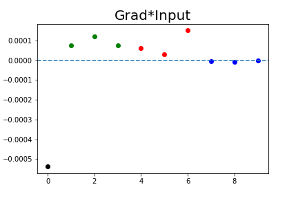
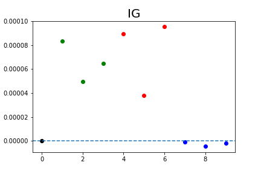
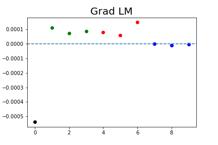
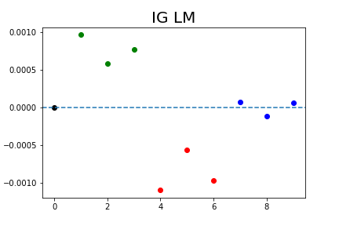
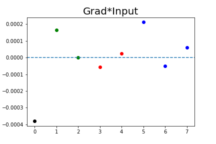

Results
================
Emre Anakok
2024-08-13

# Simple simulation

In the following simulations, we generate bipartite networks by first
simulating the corresponding latent space. The latent space, or a
transformation of it, will be use as covariates in the model. The key
difference between simulation settings is not the network generation
method, but the manner in which the available covariates are
incorporated into the model.

|     | $D_+$ | $D_0$ |  K  | $\Gamma$ | HSIC |        $H$         |
|:----|:-----:|:-----:|:---:|:--------:|:----:|:------------------:|
| 0   |   3   |   3   |  1  | $\{1\}$  |  \-  | $\mathbf{1}_{n_1}$ |
| 1   |   3   |   3   |  1  | $\{1\}$  |  \-  | $\mathbf{1}_{n_1}$ |
| 2   |   3   |  50   |  1  | $\{1\}$  |  \-  | $\mathbf{1}_{n_1}$ |
| 3   |   3   |  50   |  1  | $\{1\}$  |  \-  | $\mathbf{1}_{n_1}$ |
| 4   |   1   |   1   |  1  | $\{1\}$  |  \-  | $\mathbf{1}_{n_1}$ |
| 5   |   3   |  50   |  2  | $\{1\}$  |  \-  | $\mathbf{1}_{n_1}$ |
| 6   |   3   |   6   |  2  | $\{1\}$  |  \-  | $\mathbf{1}_{n_1}$ |
| 7   |   3   |   6   |  2  | $\{1\}$  |  \-  | $\mathbf{1}_{n_1}$ |
| 8   |   3   |   6   |  4  | $\{1\}$  |  \-  | $\mathbf{1}_{n_1}$ |
| 9   |   3   |   6   |  4  | $\{1\}$  |  \-  | $\mathbf{1}_{n_1}$ |
| 10  |   3   |   1   |  1  | $\{1\}$  |  2   | $\mathbf{1}_{n_1}$ |
| 11  |   4   |  50   |  2  | $\{1\}$  |  2   | $\mathbf{1}_{n_1}$ |
| 12  |   4   |   8   |  4  | $\{1\}$  |  2   | $\mathbf{1}_{n_1}$ |
| 13  |   4   |   8   |  4  | $\{1\}$  |  2   | $\mathbf{1}_{n_1}$ |

## Results

### Simulation 0

Simulation la plus simple

- 3 covariables ont un effet positif

- 3 covariables ont un effet négatif

- 3 covariables sont sans effet

- L’algorithme est entrainé avec toutes les covariables

<!-- -->

    ## [1] "AUC sans covariables : 0.498"

    ## [1] "AUC avec covariables : 0.716"

|     | Shapley | GRAD | GRADxInput |   IG | GRAD_LM | IG1_LM |
|:----|--------:|-----:|-----------:|-----:|--------:|-------:|
| \+  |    1.00 | 1.00 |       0.88 | 0.99 |    0.92 |   1.00 |
| \-  |    0.00 | 1.00 |       0.11 | 0.00 |    0.04 |   1.00 |
| AUC |    0.98 | 0.85 |       0.85 | 0.98 |    0.96 |   0.84 |

### Simulation 1

- 3 covariables ont un effet positif
- 3 covariables ont un effet négatif
- 3 covariables sont sans effet

L’algorithme est entrainé avec

- 2 covariables ayant un effet positif
- 2 covariables ayant un effet négatif
- 2 covariables sans effet

<!-- -->

    ## [1] "AUC sans covariables : 0.498"

    ## [1] "AUC avec covariables : 0.738"

|     | Shapley | GRAD | GRADxInput |   IG | GRAD_LM | IG1_LM |
|:----|--------:|-----:|-----------:|-----:|--------:|-------:|
| \+  |    0.53 | 1.00 |       0.27 | 0.50 |    0.30 |   0.97 |
| \-  |    0.47 | 0.98 |       0.70 | 0.52 |    0.73 |   0.98 |
| AUC |    0.74 | 0.12 |       0.68 | 0.75 |    0.83 |   0.14 |

