```{r setup, include=FALSE}
knitr::opts_chunk$set(echo = TRUE)
library(kableExtra)
```

## Network generation

In the following simulations, we generate bipartite networks by first simulating the corresponding latent space. The latent space, or a transformation of it, will be use as covariates in the model. The key difference between simulation settings is not the network generation method, but the manner in which the available covariates are incorporated into the model.


Let $n_1= 1000$ and $n_2=100$, let $D_+$ be an integer, let $D_- = D_+$ and let $D=D_+ + D_-$. Let $Z_1^+\in\mathbb{R}^{n_1 \times D_+}$ and $Z_1^-\in\mathbb{R}^{n_1 \times D_-}$ such as $Z_{1_{i,j}}^+\overset{i.i.d.}{\sim} \mathcal{N}(0,1)$ and  $Z_{1_{i,j}}^-\overset{i.i.d.}{\sim} \mathcal{N}(0,1)$ independent of $Z_1^+$. Let $Z_1 = \left[Z_1^+| Z_1^- \right]$ be the concatenation of  $Z_1^+$ and  $Z_1^-$. Let $Z_2\in\mathbb{R}^{n_2 \times D}$ such as $Z_{2_{i,j}}^+\overset{i.i.d.}{\sim} \mathcal{N}(1,1)$. For $1\leq i\leq n_1$, $Z_{1i}\in\mathbb{R}^{D}$ represents the $i$-th row of $Z_1$. Similarly, $Z_{2j}\in\mathbb{R}^{D}$ represents the $j$-th row of $Z_2$. Finally, our bipartite adjacency matrix is simulated with a Bernoulli distribution $B_{i,j} \overset{i.i.d.}{\sim} \mathcal{B}(sigmoid(Z_{1i}^\top\mathbf{I}_{D_+,D_-}Z_{2j}))$. $Z_1$ and $Z_2$ are respectively row nodes and column nodes latent representation of the generated network. Given how the network is constructed, higher values of $Z_1^+$ are expected to be positively correlated with connectivity, while higher values of $Z_1^-$ are expected to be negatively correlated with connectivity. 


## GNN inputs

In the following part, we summarize how we construct the observed $X_1$ that will be use as a covariate to fit the model. To improve readability, we will change the notation from $Z_1$ to $Z$. Let $D_0$ be an integer and let $X_1^0 \in \mathbb{R}^{n_1 \times D_0}$ be a noise matrix  with ${X}^0_{i,j}\overset{i.i.d.}{\sim} \mathcal{N}(0,1)$. The $n_1$ row nodes are partitioned into $K$ groups, node $i$ belongs to group $Q[i]$ with $Q[i]\in \{1,\dots,K\}$. If there are no groups, then $K=1$. For $1\leq k \leq K, 1\leq j \leq D$, $\gamma_{k,j}\in \{-1,0,1\}$ describes the combined effect of group $k$ on the covariate $j$. The set of value taken by $\gamma$ can change depending on the simulation setting. For $1\leq i \leq n_1, 1\leq j \leq D$, let $X$ such as $$
 X_{i,j}= \left\{
    \begin{array}{ll}
        \ \gamma_{Q[i],j}Z_{i,j}& \mbox{if } \gamma_{Q[i],j}\neq 0 \\
        \\
        \xi_{i,j}\mbox{ with } \xi_{i,j}\overset{i.i.d.}{\sim} \mathcal{N}(0,1) & \mbox{if }  \gamma_{Q[i],j}=0
    \end{array}
\right.
$$Finally, we define $$X_1 = \left[H|X|X^0 \right]$$ where $H$ is the intercept. $X_2 = \mathbf{1}_{n_2}$ is a column made of $1$.  BGVAE is trained with adjacency matrix $B$ and covariates $X_1,X_2$. The learning can also be done with the fair-BGVAE. In this case, some input columns of $X_1$ are selected and the learning is penalized by the HSIC between the estimated latent space and these columns. Once the model trained, previously described attribution methods are fit on $f_{\widehat{B}}(X_1)$ to study the impact of the features of $X_1$ on connectivity.

## Settings

Parameter settings are presented in the following table. We remind that the true latent space is of size $D = D_+ + D_-$ with $D_+ = D_-$, and $D_0$ is the number of the noise covariates. $K$ is the number of groups. $\Gamma$ represents the set of value possibily taken by $\gamma$. The HSIC columns determine how much columns of $X_1$ are penalized by the HSIC during the learning of the Fair BVGAE, empty values correspond to classical BVGAE learning. $H$ corresponds to the intercept.

```{r,echo=FALSE}
table_settings1 = data.frame(row.names = 0:13)
table_settings1["D"] = c(3,3,3,3,1,3,3,3,3,3,3,4,4,4)
table_settings1["D0"] = c(3,3,50,50,1,50,6,6,6,6,1,50,8,8)
table_settings1["K"] = c(1)
table_settings1[c(6,7,8,9,10,12,13,14),"K"] = c(2,2,2,4,4,2,4,4)
table_settings1["g"] = c("$\\{1\\}$")
table_settings1[c(5,6,8,12),"g"] = c("$\\{1,-1\\}$")
table_settings1[c(7,9,10,13,14),"g"] = c("$\\{1,0,-1\\}$")
table_settings1["HSIC"] = c("_")
table_settings1[c(11,12,13,14),"HSIC"] = c(2)
table_settings1["H"] = c("$\\mathbf{1}_{n_1}$")
table_settings1[c(8,10,14),"H"] = c("$[\\mathbf{1}_{n_1},P]$")
names(table_settings1) = c("$D_+$","$D_0$","K","$\\Gamma$","HSIC","$H$")
kable(table_settings1,booktabs=TRUE,escape = FALSE,align="c",caption ="Parameter table") %>%kable_styling("hover",full_width = T)
```


## Results {.tabset}

For all simulations, the AUC for link prediction with and without covariates are displayed to demonstrate the impact of covariates on the model's learning.


### Simulation 0 

Easiest simulation

* 3 covariates have a positive effect
* 3 covariates have a negative effect
* 3 covariates have no effect

* The algorithm is trained with all the covariates


```{r, fig.dim=c(5, 3),echo=FALSE}
X=read.table("results_for_rmd/res0/res.csv",sep=",",header=T,row.names = 1)
```

```{r,echo=FALSE}
print(paste0("AUC without covariates: " , round(mean(X$AUC0),3) ))
print(paste0("AUC with covariates: " , round(mean(X$AUC1),3) ))
```

```{r, fig.dim=c(5, 3),echo=FALSE}
restable = matrix(colMeans(X[3:ncol(X)]),nrow=3)
rownames(restable)= c("+","-","AUC")
colnames(restable) = c("GraphSVX","GRAD","GRADxInput","IG","GRAD_LM","IG1_LM")

kable(restable,digits = 2)
```

* The dashed line is positioned at zero. 
* The black dot represents the estimated score for the intercept. 
* The green dots represent the estimated score for features where positive values are expected.
* The red dots represent the estimated score for features where negative values are expected.
* The blue dots are scores attributed to noise. 


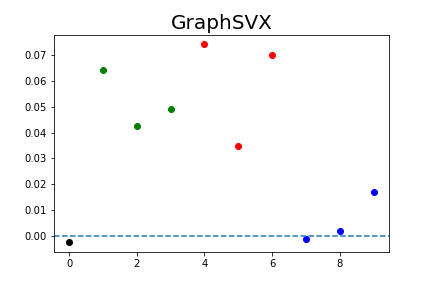


### Simulation 1 

The network is generated with

* 3 covariates have a positive effect
* 3 covariates have a negative effect

The algorithm is trained with

* 2 covariates with positive effect
* 2 covariates with negative effect
* 3 covariates with no effect

```{r, fig.dim=c(5, 3),echo=FALSE}
X=read.table("results_for_rmd/res1/res.csv",sep=",",header=T,row.names = 1)
```

```{r,echo=FALSE}
print(paste0("AUC without covariates: " , round(mean(X$AUC0),3) ))
print(paste0("AUC with covariates: " , round(mean(X$AUC1),3) ))
```

```{r, fig.dim=c(5, 3),echo=FALSE}
restable = matrix(colMeans(X[3:ncol(X)]),nrow=3)
rownames(restable)= c("+","-","AUC")
colnames(restable) = c("GraphSVX","GRAD","GRADxInput","IG","GRAD_LM","IG1_LM")

kable(restable,digits = 2)
```

* The dashed line is positioned at zero. 
* The black dot represents the estimated score for the intercept. 
* The green dots represent the estimated score for features where positive values are expected.
* The red dots represent the estimated score for features where negative values are expected.
* The blue dots are scores attributed to noise. 


### Simulation 2


* 3 covariates have a positive effect
* 3 covariates have a negative effect
* 50 covariates have no effect

* The algorithm is trained with all the covariates

```{r, fig.dim=c(5, 3),echo=FALSE}
X=read.table("results_for_rmd/res2/res.csv",sep=",",header=T,row.names = 1)
```

```{r,echo=FALSE}
print(paste0("AUC without covariates: " , round(mean(X$AUC0),3) ))
print(paste0("AUC with covariates: " , round(mean(X$AUC1),3) ))
```

```{r, fig.dim=c(5, 3),echo=FALSE}
restable = matrix(colMeans(X[3:ncol(X)]),nrow=3)
rownames(restable)= c("+","-","AUC")
colnames(restable) = c("GraphSVX","GRAD","GRADxInput","IG","GRAD_LM","IG1_LM")

kable(restable,digits = 2)
```

* The dashed line is positioned at zero. 
* The black dot represents the estimated score for the intercept. 
* The green dots represent the estimated score for features where positive values are expected.
* The red dots represent the estimated score for features where negative values are expected.
* The blue dots are scores attributed to noise. 


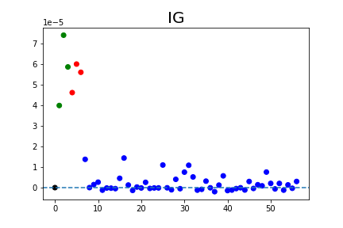


### Simulation 3

The network is generated with

* 3 covariates with a positive effect
* 3 covariates with a negative effect

The algorithm is trained with

* 2 covariates with positive effect
* 2 covariates with negative effect
* 50 covariates have no effect


```{r, fig.dim=c(5, 3),echo=FALSE}
X=read.table("results_for_rmd/res3/res.csv",sep=",",header=T,row.names = 1)
```

```{r,echo=FALSE}
print(paste0("AUC without covariates: " , round(mean(X$AUC0),3) ))
print(paste0("AUC with covariates: " , round(mean(X$AUC1),3) ))
```

```{r, fig.dim=c(5, 3),echo=FALSE}
restable = matrix(colMeans(X[3:ncol(X)]),nrow=3)
rownames(restable)= c("+","-","AUC")
colnames(restable) = c("GraphSVX","GRAD","GRADxInput","IG","GRAD_LM","IG1_LM")

kable(restable,digits = 2)
```

* The dashed line is positioned at zero. 
* The black dot represents the estimated score for the intercept. 
* The green dots represent the estimated score for features where positive values are expected.
* The red dots represent the estimated score for features where negative values are expected.
* The blue dots are scores attributed to noise. 


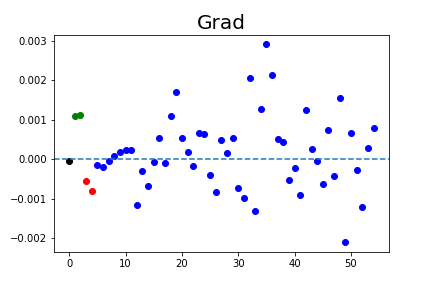


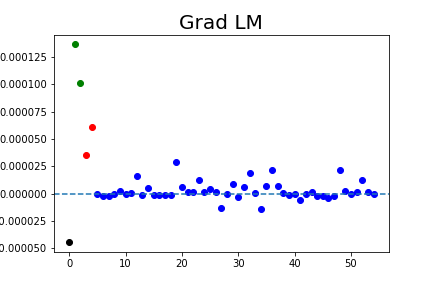


### Simulation 4


* 1 covariate has an effect (+ or -) that depends on a group
* 1 covariate has a negative effect
* 1 covariate has no effect

* The algorithm is trained with all the covariates


```{r, fig.dim=c(5, 3),echo=FALSE}
X=read.table("results_for_rmd/res4/res.csv",sep=",",header=T,row.names = 1)
```

```{r,echo=FALSE}
print(paste0("AUC without covariates: " , round(mean(X$AUC0),3) ))
print(paste0("AUC with covariates: " , round(mean(X$AUC1),3) ))
```

```{r, fig.dim=c(5, 3),echo=FALSE}
restable = matrix(colMeans(X[3:ncol(X)]),nrow=3)
rownames(restable)= c("+","-","AUC")
colnames(restable) = c("GraphSVX","GRAD","GRADxInput","IG","GRAD_LM","IG1_LM")

kable(restable,digits = 2)
```

For all plot, each row represents a group, while each column represents a feature. The top six graphics display the estimated scores for all features. For each cell, the border frame represents the expected value, while the interior represents the estimated value.

* The black frames represent the estimated score for the intercept,
* The green  frames represent the score for features where positive values are expected
* The red frames represent the score for features negative values are expected
* The blue frames are scores attributed to noise. 

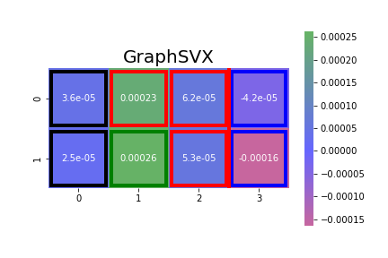


### Simulation 5


* 6 covariates have an effect (+ or -) that depends on a group
* 50 covariates have no effect


```{r, fig.dim=c(5, 3),echo=FALSE}
X=read.table("results_for_rmd/res5/res.csv",sep=",",header=T,row.names = 1)
```

```{r,echo=FALSE}
print(paste0("AUC without covariates: " , round(mean(X$AUC0),3) ))
print(paste0("AUC with covariates: " , round(mean(X$AUC1),3) ))
```

```{r, fig.dim=c(5, 3),echo=FALSE}
restable = matrix(colMeans(X[3:ncol(X)]),nrow=3)
rownames(restable)= c("+","-","AUC")
colnames(restable) = c("GraphSVX","GRAD","GRADxInput","IG","GRAD_LM","IG1_LM")

kable(restable,digits = 2)
```

For all plot, each row represents a group, while each column represents a feature. The top six graphics display the estimated scores for all features. Features to the right of the red lines are noise. The bottom six graphics are zoomed-in sections of the left portion of the top six graphics. For each cell, the border frame represents the expected value, while the interior represents the estimated value.

* The black frames represent the estimated score for the intercept,
* The green  frames represent the score for features where positive values are expected
* The red frames represent the score for features negative values are expected
* The blue frames are scores attributed to noise. 


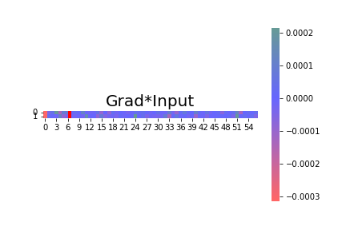


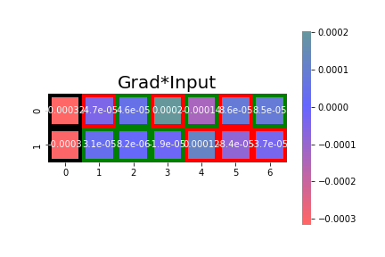


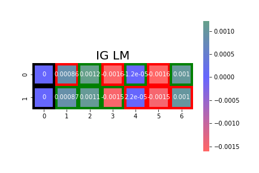


### Simulation 6

* 6 covariates have an effect (+ or - or 0) that depends on a group
* 6 covariates have no effect


```{r, fig.dim=c(5, 3),echo=FALSE}
X=read.table("results_for_rmd/res6/res.csv",sep=",",header=T,row.names = 1)
```

```{r,echo=FALSE}
print(paste0("AUC without covariates: " , round(mean(X$AUC0),3) ))
print(paste0("AUC with covariates: " , round(mean(X$AUC1),3) ))
```

```{r, fig.dim=c(5, 3),echo=FALSE}
restable = matrix(colMeans(X[3:ncol(X)]),nrow=3)
rownames(restable)= c("+","-","AUC")
colnames(restable) = c("GraphSVX","GRAD","GRADxInput","IG","GRAD_LM","IG1_LM")

kable(restable,digits = 2)
```

For all plot, each row represents a group, while each column represents a feature. The top six graphics display the estimated scores for all features. Features to the right of the red lines are noise. The bottom six graphics are zoomed-in sections of the left portion of the top six graphics. For each cell, the border frame represents the expected value, while the interior represents the estimated value.

* The black frames represent the estimated score for the intercept,
* The green  frames represent the score for features where positive values are expected
* The red frames represent the score for features negative values are expected
* The blue frames are scores attributed to noise. 


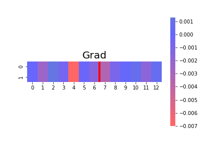

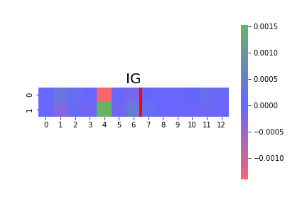


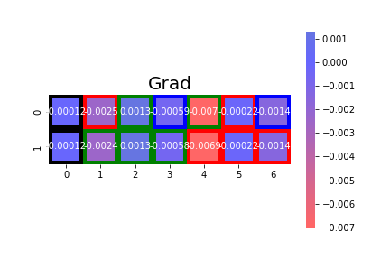


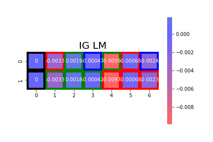


### Simulation 7

* 6 covariates have an effect (+ or -) that depends on a group
* 6 covariates have no effect

* the group is included as a covariate


```{r, fig.dim=c(5, 3),echo=FALSE}
X=read.table("results_for_rmd/res7/res.csv",sep=",",header=T,row.names = 1)
```

```{r,echo=FALSE}
print(paste0("AUC without covariates: " , round(mean(X$AUC0),3) ))
print(paste0("AUC with covariates: " , round(mean(X$AUC1),3) ))
```

```{r, fig.dim=c(5, 3),echo=FALSE}
restable = matrix(colMeans(X[3:ncol(X)]),nrow=3)
rownames(restable)= c("+","-","AUC")
colnames(restable) = c("GraphSVX","GRAD","GRADxInput","IG","GRAD_LM","IG1_LM")

kable(restable,digits = 2)
```

For all plot, each row represents a group, while each column represents a feature. The top six graphics display the estimated scores for all features. Features to the right of the red lines are noise. The bottom six graphics are zoomed-in sections of the left portion of the top six graphics. For each cell, the border frame represents the expected value, while the interior represents the estimated value.

* The black frames represent the estimated score for the intercept,
* The green  frames represent the score for features where positive values are expected
* The red frames represent the score for features negative values are expected
* The blue frames are scores attributed to noise.
* The sign "+" or "-" denotes the sign of the estimated score within each cell.


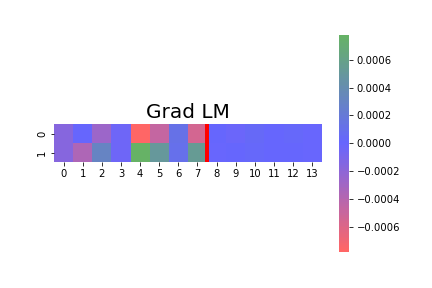


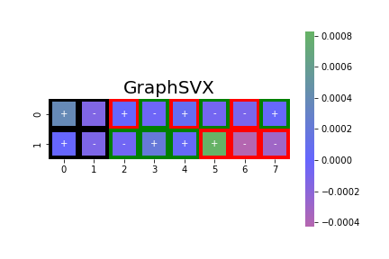


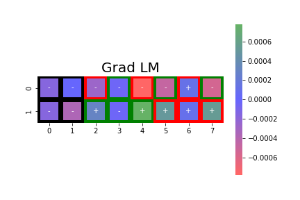


### Simulation 8

* 6 covariates have an effect (+ or - or 0) that depends on a group
* 6 covariates have no effect
* 4 groups with different effects


```{r, fig.dim=c(5, 3),echo=FALSE}
X=read.table("results_for_rmd/res8/res.csv",sep=",",header=T,row.names = 1)
```

```{r,echo=FALSE}
print(paste0("AUC without covariates: " , round(mean(X$AUC0),3) ))
print(paste0("AUC with covariates: " , round(mean(X$AUC1),3) ))
```

```{r, fig.dim=c(5, 3),echo=FALSE}
restable = matrix(colMeans(X[3:ncol(X)]),nrow=3)
rownames(restable)= c("+","-","AUC")
colnames(restable) = c("GraphSVX","GRAD","GRADxInput","IG","GRAD_LM","IG1_LM")

kable(restable,digits = 2)
```

For all plot, each row represents a group, while each column represents a feature. The top six graphics display the estimated scores for all features. Features to the right of the red lines are noise. The bottom six graphics are zoomed-in sections of the left portion of the top six graphics. For each cell, the border frame represents the expected value, while the interior represents the estimated value.

* The black frames represent the estimated score for the intercept,
* The green  frames represent the score for features where positive values are expected
* The red frames represent the score for features negative values are expected
* The blue frames are scores attributed to noise.
* The sign "+" or "-" denotes the sign of the estimated score within each cell.

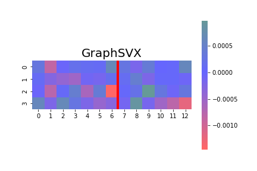
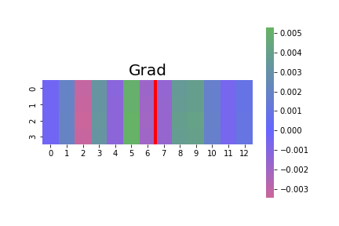
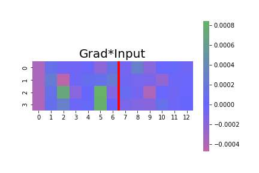
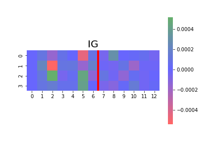

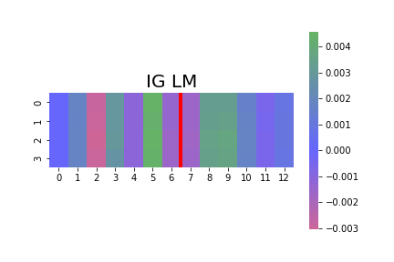


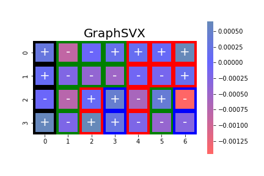
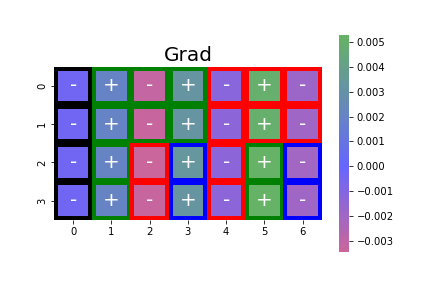
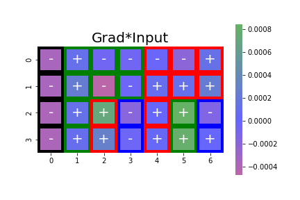
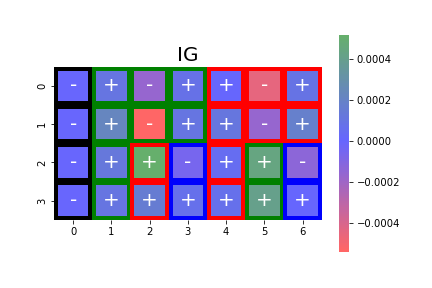
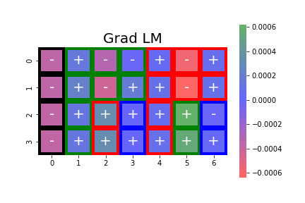


### Simulation 9

* 6 covariates have an effect (+ or - or 0) that depends on a group
* 6 covariates have no effect
* 4 groups with different effects

* the group is included as a covariate


```{r, fig.dim=c(5, 3),echo=FALSE}
X=read.table("results_for_rmd/res9/res.csv",sep=",",header=T,row.names = 1)
```

```{r,echo=FALSE}
print(paste0("AUC without covariates: " , round(mean(X$AUC0),3) ))
print(paste0("AUC with covariates: " , round(mean(X$AUC1),3) ))
```

```{r, fig.dim=c(5, 3),echo=FALSE}
restable = matrix(colMeans(X[3:ncol(X)]),nrow=3)
rownames(restable)= c("+","-","AUC")
colnames(restable) = c("GraphSVX","GRAD","GRADxInput","IG","GRAD_LM","IG1_LM")

kable(restable,digits = 2)
```

For all plot, each row represents a group, while each column represents a feature. The top six graphics display the estimated scores for all features. Features to the right of the red lines are noise. The bottom six graphics are zoomed-in sections of the left portion of the top six graphics. For each cell, the border frame represents the expected value, while the interior represents the estimated value.

* The black frames represent the estimated score for the intercept,
* The green  frames represent the score for features where positive values are expected
* The red frames represent the score for features negative values are expected
* The blue frames are scores attributed to noise.


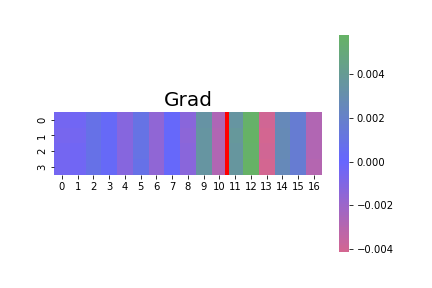

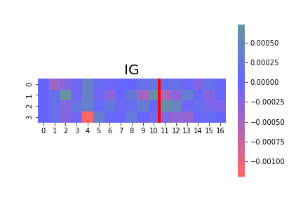
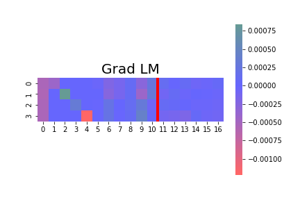


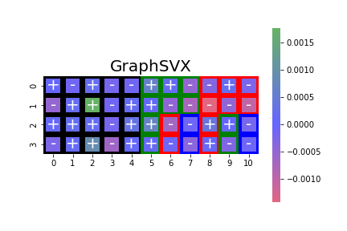
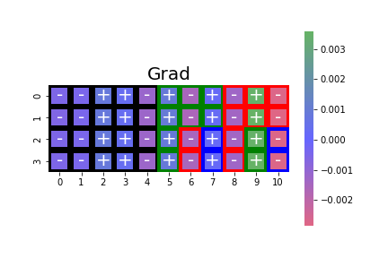

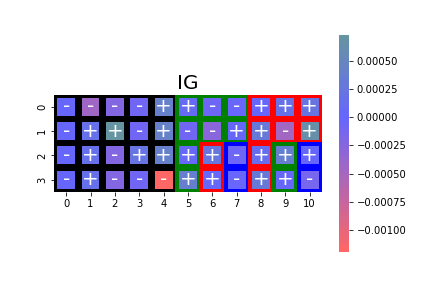


### Simulation 10


* 3 covariates have a positive effect
* 3 covariates have a negative effect
* 3 covariates have no effect
* The first covariate with a positive effect and the one with a negative effect are penalized with the HSIC

The goal is to see if the scores assigned to the variables penalized by the HSIC are smaller than the others.


```{r, fig.dim=c(5, 3),echo=FALSE}
X=read.table("results_for_rmd/res10/res.csv",sep=",",header=T,row.names = 1)
```

```{r,echo=FALSE}
print(paste0("AUC without covariates: " , round(mean(X$AUC0),3) ))
print(paste0("AUC with covariates: " , round(mean(X$AUC1),3) ))
```

```{r, fig.dim=c(5, 3),echo=FALSE}
restable = matrix(colMeans(X[3:ncol(X)]),nrow=3)
rownames(restable)= c("+","-","AUC")
colnames(restable) = c("GraphSVX","GRAD","GRADxInput","IG","GRAD_LM","IG1_LM")

kable(restable,digits = 2)
```

* The dashed line is positioned at zero. 
* The black dot represents the estimated score for the intercept. 
* The green dots represent the estimated score for features where positive values are expected.
* The red dots represent the estimated score for features where negative values are expected.
* The blue dots are scores attributed to noise. 
* Variables penalized by the HSIC are represented with a cross.


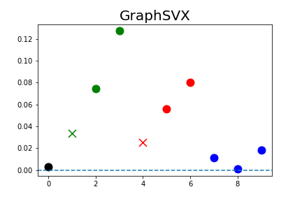
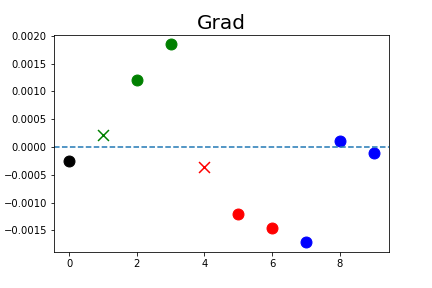
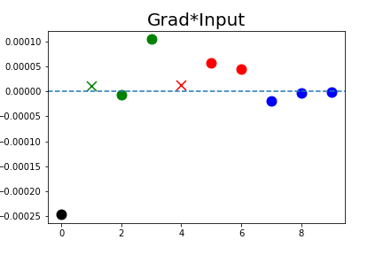
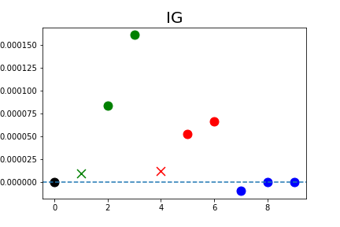
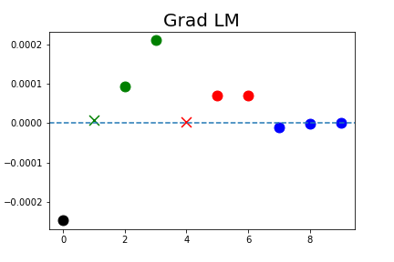
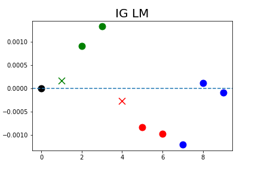


### Simulation 11

* 8 covariates have an effect (+ or -) that depends on a group
* 50 covariates have no effect
* The first covariate with a positive effect and the one with a negative effect are penalized with the HSIC

The goal is to see if the scores assigned to the variables penalized by the HSIC are smaller than the others.


```{r, fig.dim=c(5, 3),echo=FALSE}
X=read.table("results_for_rmd/res11/res.csv",sep=",",header=T,row.names = 1)
```

```{r,echo=FALSE}
print(paste0("AUC without covariates: " , round(mean(X$AUC0),3) ))
print(paste0("AUC with covariates: " , round(mean(X$AUC1),3) ))
```

```{r, fig.dim=c(5, 3),echo=FALSE}
restable = matrix(colMeans(X[3:ncol(X)]),nrow=3)
rownames(restable)= c("+","-","AUC")
colnames(restable) = c("GraphSVX","GRAD","GRADxInput","IG","GRAD_LM","IG1_LM")

kable(restable,digits = 2)
```

For all plot, each row represents a group, while each column represents a feature. The top six graphics display the estimated scores for all features. Features to the right of the red lines are noise. The bottom six graphics are zoomed-in sections of the left portion of the top six graphics. For each cell, the border frame represents the expected value, while the interior represents the estimated value.

* The black frames represent the estimated score for the intercept,
* The green  frames represent the score for features where positive values are expected
* The red frames represent the score for features negative values are expected
* The blue frames are scores attributed to noise or to variable penalized by the HSIC. 


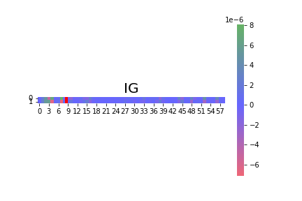


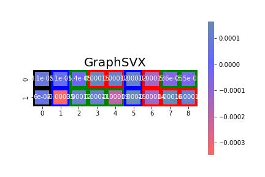


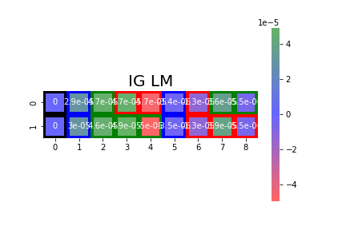


### Simulation 12

* 8 covariates have an effect (+ or - or 0) that depends on a group
* 8 covariates have no effect
* 4 groups with different effects
* 2 covariates are penalized with the HSIC


```{r, fig.dim=c(5, 3),echo=FALSE}
X=read.table("results_for_rmd/res12/res.csv",sep=",",header=T,row.names = 1)
```

```{r,echo=FALSE}
print(paste0("AUC without covariates: " , round(mean(X$AUC0),3) ))
print(paste0("AUC with covariates: " , round(mean(X$AUC1),3) ))
```

```{r, fig.dim=c(5, 3),echo=FALSE}
restable = matrix(colMeans(X[3:ncol(X)]),nrow=3)
rownames(restable)= c("+","-","AUC")
colnames(restable) = c("GraphSVX","GRAD","GRADxInput","IG","GRAD_LM","IG1_LM")

kable(restable,digits = 2)
```

For all plot, each row represents a group, while each column represents a feature. The top six graphics display the estimated scores for all features. Features to the right of the red lines are noise. The bottom six graphics are zoomed-in sections of the left portion of the top six graphics. For each cell, the border frame represents the expected value, while the interior represents the estimated value.

* The black frames represent the estimated score for the intercept,
* The green  frames represent the score for features where positive values are expected
* The red frames represent the score for features negative values are expected
* The blue frames are scores attributed to noise or to variable penalized by the HSIC. 
* The sign "+" or "-" denotes the sign of the estimated score within each cell.

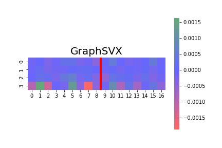

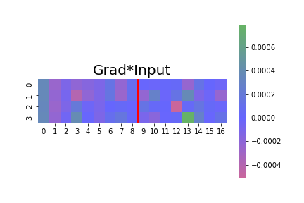


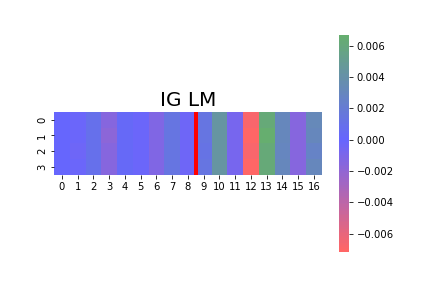


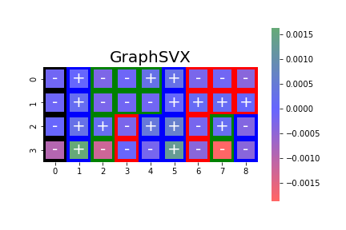


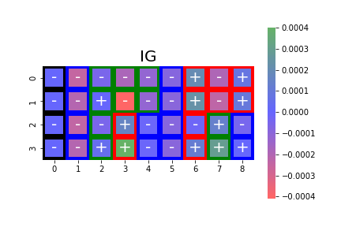

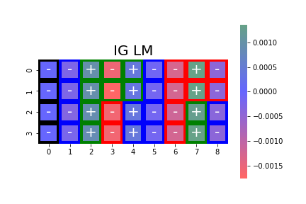

### Simulation 13


* 8 covariates have an effect (+ or - or 0) that depends on a group
* 8 covariates have no effect
* 4 groups with different effects
* 2 covariates are penalized with the HSIC
* the group is included as a covariate


```{r, fig.dim=c(5, 3),echo=FALSE}
X=read.table("results_for_rmd/res13/res.csv",sep=",",header=T,row.names = 1)
```

```{r,echo=FALSE}
print(paste0("AUC without covariates: " , round(mean(X$AUC0),3) ))
print(paste0("AUC with covariates: " , round(mean(X$AUC1),3) ))
```

```{r, fig.dim=c(5, 3),echo=FALSE}
restable = matrix(colMeans(X[3:ncol(X)]),nrow=3)
rownames(restable)= c("+","-","AUC")
colnames(restable) = c("GraphSVX","GRAD","GRADxInput","IG","GRAD_LM","IG1_LM")

kable(restable,digits = 2)
```

For all plot, each row represents a group, while each column represents a feature. The top six graphics display the estimated scores for all features. Features to the right of the red lines are noise. The bottom six graphics are zoomed-in sections of the left portion of the top six graphics. For each cell, the border frame represents the expected value, while the interior represents the estimated value.

* The black frames represent the estimated score for the intercept,
* The green  frames represent the score for features where positive values are expected
* The red frames represent the score for features negative values are expected
* The blue frames are scores attributed to noise or to variable penalized by the HSIC. 
* The sign "+" or "-" denotes the sign of the estimated score within each cell.

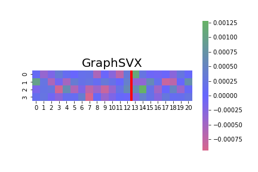
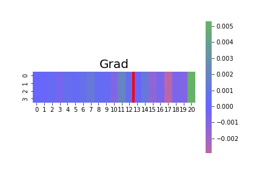
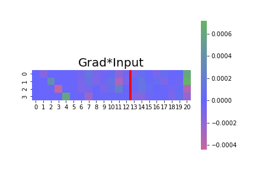

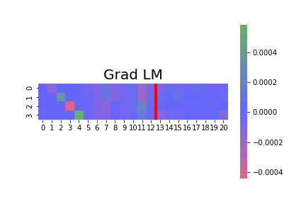


