```{r setup, include=FALSE}
knitr::opts_chunk$set(echo = TRUE)
library(kableExtra)
```


## Results {.tabset}

### Simulation 0 

Simulation la plus simple

* 3 covariables ont un effet positif
* 3 covariables ont un effet négatif
* 3 covariables sont sans effet

* L'algorithme est entrainé avec toutes les covariables


```{r, fig.dim=c(5, 3),echo=FALSE}
X=read.table("results_for_rmd/res0/res.csv",sep=",",header=T,row.names = 1)
```

```{r,echo=FALSE}
print(paste0("AUC sessions-insectes sans covariables : " , round(mean(X$AUC0),3) ))
print(paste0("AUC sessions-insectes avec covariables : " , round(mean(X$AUC1),3) ))
```

```{r,echo=FALSE}
print(paste0("AUC plantes-insectes sans covariables : " , round(mean(X$AUC3_0),3) ))
print(paste0("AUC plantes-insectes avec covariables : " , round(mean(X$AUC3_1),3) ))
```

```{r, fig.dim=c(5, 3),echo=FALSE}
restable = matrix(colMeans(X[5:ncol(X)]),nrow=3)
rownames(restable)= c("+","-","AUC")
colnames(restable) = c("Shapley","GRAD","GRADxInput","IG","GRAD_LM","IG1_LM")

kable(restable,digits = 2)
```


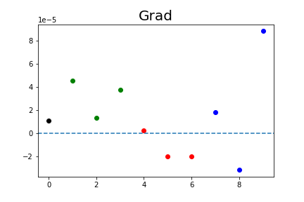
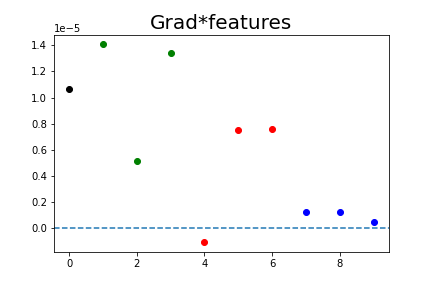


### Simulation 1 


* 3 covariables ont un effet positif
* 3 covariables ont un effet négatif
* 3 covariables sont sans effet

L'algorithme est entrainé avec 

* 2 covariables ayant un effet positif
* 2 covariables ayant un effet négatif
* 2 covariables sans effet

```{r, fig.dim=c(5, 3),echo=FALSE}
X=read.table("results_for_rmd/res1/res.csv",sep=",",header=T,row.names = 1)
```

```{r,echo=FALSE}
print(paste0("AUC sessions-insectes sans covariables : " , round(mean(X$AUC0),3) ))
print(paste0("AUC sessions-insectes avec covariables : " , round(mean(X$AUC1),3) ))
```

```{r,echo=FALSE}
print(paste0("AUC plantes-insectes sans covariables : " , round(mean(X$AUC3_0),3) ))
print(paste0("AUC plantes-insectes avec covariables : " , round(mean(X$AUC3_1),3) ))
```

```{r, fig.dim=c(5, 3),echo=FALSE}
restable = matrix(colMeans(X[5:ncol(X)]),nrow=3)
rownames(restable)= c("+","-","AUC")
colnames(restable) = c("Shapley","GRAD","GRADxInput","IG","GRAD_LM","IG1_LM")

kable(restable,digits = 2)
```


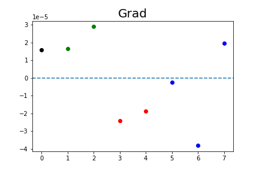


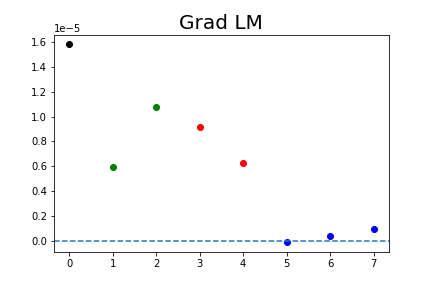
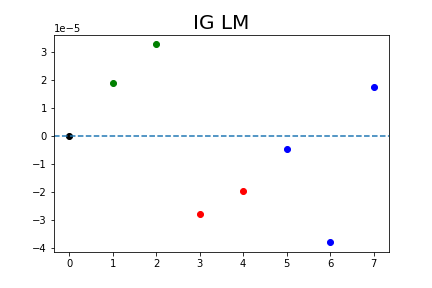

### Simulation 2


* 3 covariables ont un effet positif
* 3 covariables ont un effet négatif
* 50 covariables sont sans effet

* L'algorithme est entrainé avec toutes les covariables

```{r, fig.dim=c(5, 3),echo=FALSE}
X=read.table("results_for_rmd/res2/res.csv",sep=",",header=T,row.names = 1)
```

```{r,echo=FALSE}
print(paste0("AUC sessions-insectes sans covariables : " , round(mean(X$AUC0),3) ))
print(paste0("AUC sessions-insectes avec covariables : " , round(mean(X$AUC1),3) ))
```

```{r,echo=FALSE}
print(paste0("AUC plantes-insectes sans covariables : " , round(mean(X$AUC3_0),3) ))
print(paste0("AUC plantes-insectes avec covariables : " , round(mean(X$AUC3_1),3) ))
```

```{r, fig.dim=c(5, 3),echo=FALSE}
restable = matrix(colMeans(X[5:ncol(X)]),nrow=3)
rownames(restable)= c("+","-","AUC")
colnames(restable) = c("Shapley","GRAD","GRADxInput","IG","GRAD_LM","IG1_LM")

kable(restable,digits = 2)
```


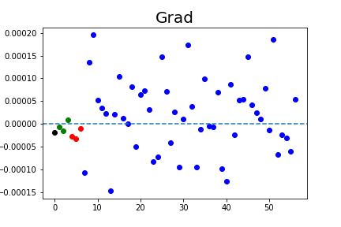
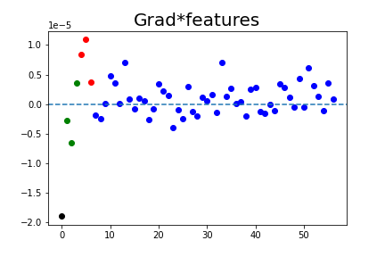
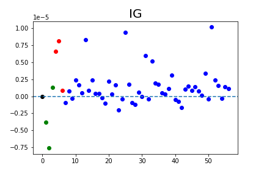


### Simulation 3


* 3 covariables ont un effet positif
* 3 covariables ont un effet négatif
* 50 covariables sont sans effet

* L'algorithme est entrainé avec 

* 2 covariables ayant un effet positif
* 2 covariables ayant un effet négatif
* 50 covariables sans effet


```{r, fig.dim=c(5, 3),echo=FALSE}
X=read.table("results_for_rmd/res3/res.csv",sep=",",header=T,row.names = 1)
```

```{r,echo=FALSE}
print(paste0("AUC sessions-insectes sans covariables : " , round(mean(X$AUC0),3) ))
print(paste0("AUC sessions-insectes avec covariables : " , round(mean(X$AUC1),3) ))
```

```{r,echo=FALSE}
print(paste0("AUC plantes-insectes sans covariables : " , round(mean(X$AUC3_0),3) ))
print(paste0("AUC plantes-insectes avec covariables : " , round(mean(X$AUC3_1),3) ))
```
```{r, fig.dim=c(5, 3),echo=FALSE}
restable = matrix(colMeans(X[5:ncol(X)]),nrow=3)
rownames(restable)= c("+","-","AUC")
colnames(restable) = c("Shapley","GRAD","GRADxInput","IG","GRAD_LM","IG1_LM")

kable(restable,digits = 2)
```


### Simulation 4


* 1 covariable a un effet qui dépend d'un groupe
* 1 covariable a un effet négatif
* 1 covariable sans effet


```{r, fig.dim=c(5, 3),echo=FALSE}
X=read.table("results_for_rmd/res4/res.csv",sep=",",header=T,row.names = 1)
```

```{r,echo=FALSE}
print(paste0("AUC sessions-insectes sans covariables : " , round(mean(X$AUC0),3) ))
print(paste0("AUC sessions-insectes avec covariables : " , round(mean(X$AUC1),3) ))
```
```{r,echo=FALSE}
print(paste0("AUC plantes-insectes sans covariables : " , round(mean(X$AUC3_0),3) ))
print(paste0("AUC plantes-insectes avec covariables : " , round(mean(X$AUC3_1),3) ))
```

```{r, fig.dim=c(5, 3),echo=FALSE}
restable = matrix(colMeans(X[5:ncol(X)]),nrow=3)
rownames(restable)= c("+","-","AUC")
colnames(restable) = c("Shapley","GRAD","GRADxInput","IG","GRAD_LM","IG1_LM")

kable(restable,digits = 2)
```


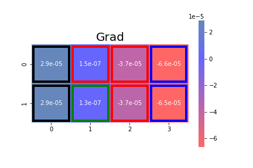
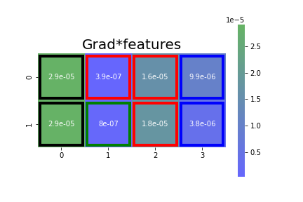
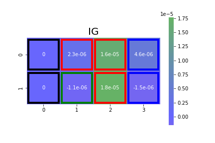


### Simulation 5


* 6 covariables ont un effet qui dépend d'un groupe (positif/négatif)
* 50 covariables sans effet


```{r, fig.dim=c(5, 3),echo=FALSE}
X=read.table("results_for_rmd/res5/res.csv",sep=",",header=T,row.names = 1)
```

```{r,echo=FALSE}
print(paste0("AUC sessions-insectes sans covariables : " , round(mean(X$AUC0),3) ))
print(paste0("AUC sessions-insectes avec covariables : " , round(mean(X$AUC1),3) ))
```

```{r,echo=FALSE}
print(paste0("AUC plantes-insectes sans covariables : " , round(mean(X$AUC3_0),3) ))
print(paste0("AUC plantes-insectes avec covariables : " , round(mean(X$AUC3_1),3) ))
```
```{r, fig.dim=c(5, 3),echo=FALSE}
restable = matrix(colMeans(X[5:ncol(X)]),nrow=3)
rownames(restable)= c("+","-","AUC")
colnames(restable) = c("Shapley","GRAD","GRADxInput","IG","GRAD_LM","IG1_LM")

kable(restable,digits = 2)
```


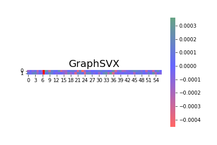
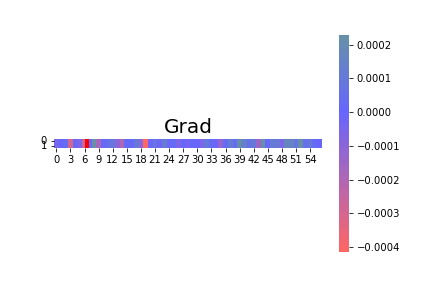
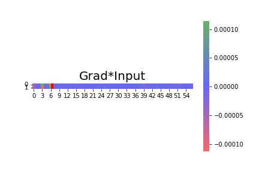


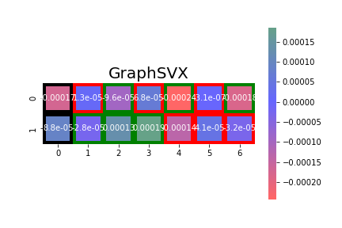


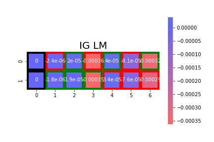


### Simulation 6

* 6 covariables ont un effet qui dépend d'un groupe (positif/négatif/nul)
* 6 covariables sans effet


```{r, fig.dim=c(5, 3),echo=FALSE}
X=read.table("results_for_rmd/res6/res.csv",sep=",",header=T,row.names = 1)
```

```{r,echo=FALSE}
print(paste0("AUC sessions-insectes sans covariables : " , round(mean(X$AUC0),3) ))
print(paste0("AUC sessions-insectes avec covariables : " , round(mean(X$AUC1),3) ))
```

```{r,echo=FALSE}
print(paste0("AUC plantes-insectes sans covariables : " , round(mean(X$AUC3_0),3) ))
print(paste0("AUC plantes-insectes avec covariables : " , round(mean(X$AUC3_1),3) ))
```
```{r, fig.dim=c(5, 3),echo=FALSE}
restable = matrix(colMeans(X[5:ncol(X)]),nrow=3)
rownames(restable)= c("+","-","AUC")
colnames(restable) = c("Shapley","GRAD","GRADxInput","IG","GRAD_LM","IG1_LM")

kable(restable,digits = 2)
```


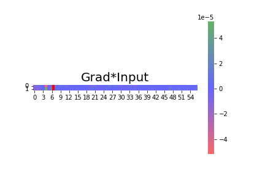

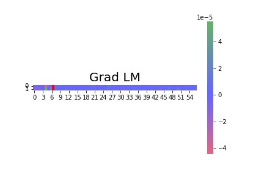


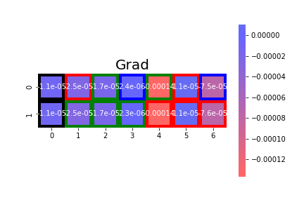
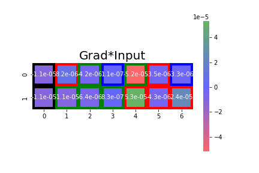

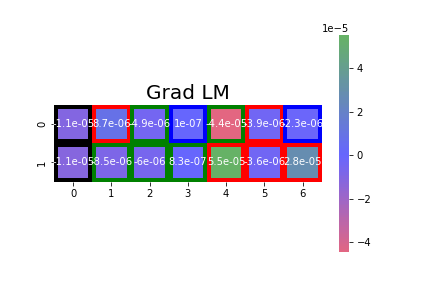


### Simulation 7

* 6 covariables ont un effet qui dépend d'un groupe (positif/négatif)
* 6 covariables sans effet
* on passe le groupe en covariable


```{r, fig.dim=c(5, 3),echo=FALSE}
X=read.table("results_for_rmd/res7/res.csv",sep=",",header=T,row.names = 1)
```

```{r,echo=FALSE}
print(paste0("AUC sessions-insectes sans covariables : " , round(mean(X$AUC0),3) ))
print(paste0("AUC sessions-insectes avec covariables : " , round(mean(X$AUC1),3) ))
```

```{r,echo=FALSE}
print(paste0("AUC plantes-insectes sans covariables : " , round(mean(X$AUC3_0),3) ))
print(paste0("AUC plantes-insectes avec covariables : " , round(mean(X$AUC3_1),3) ))
```
```{r, fig.dim=c(5, 3),echo=FALSE}
restable = matrix(colMeans(X[5:ncol(X)]),nrow=3)
rownames(restable)= c("+","-","AUC")
colnames(restable) = c("Shapley","GRAD","GRADxInput","IG","GRAD_LM","IG1_LM")

kable(restable,digits = 2)
```


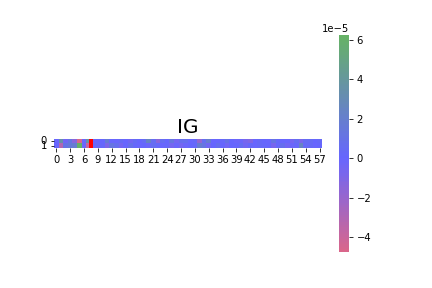


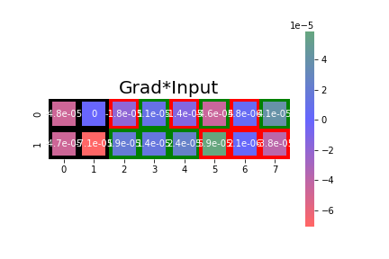


### Simulation 8

* 6 covariables ont un effet qui dépend d'un groupe (positif/négatif/nul)
* 6 covariables sans effet
* 4 groupes avec des effets différents 


```{r, fig.dim=c(5, 3),echo=FALSE}
X=read.table("results_for_rmd/res8/res.csv",sep=",",header=T,row.names = 1)
```

```{r,echo=FALSE}
print(paste0("AUC sessions-insectes sans covariables : " , round(mean(X$AUC0),3) ))
print(paste0("AUC sessions-insectes avec covariables : " , round(mean(X$AUC1),3) ))
```

```{r,echo=FALSE}
print(paste0("AUC plantes-insectes sans covariables : " , round(mean(X$AUC3_0),3) ))
print(paste0("AUC plantes-insectes avec covariables : " , round(mean(X$AUC3_1),3) ))
```
```{r, fig.dim=c(5, 3),echo=FALSE}
restable = matrix(colMeans(X[5:ncol(X)]),nrow=3)
rownames(restable)= c("+","-","AUC")
colnames(restable) = c("Shapley","GRAD","GRADxInput","IG","GRAD_LM","IG1_LM")

kable(restable,digits = 2)
```


### Simulation 9

* 6 covariables ont un effet qui dépend d'un groupe (positif/négatif/nul)
* 6 covariables sans effet
* 4 groupes avec des effets différents 
* les 4 groupes sont mis en covariables 


```{r, fig.dim=c(5, 3),echo=FALSE}
X=read.table("results_for_rmd/res9/res.csv",sep=",",header=T,row.names = 1)
```

```{r,echo=FALSE}
print(paste0("AUC sessions-insectes sans covariables : " , round(mean(X$AUC0),3) ))
print(paste0("AUC sessions-insectes avec covariables : " , round(mean(X$AUC1),3) ))
```

```{r,echo=FALSE}
print(paste0("AUC plantes-insectes sans covariables : " , round(mean(X$AUC3_0),3) ))
print(paste0("AUC plantes-insectes avec covariables : " , round(mean(X$AUC3_1),3) ))
```
```{r, fig.dim=c(5, 3),echo=FALSE}
restable = matrix(colMeans(X[5:ncol(X)]),nrow=3)
rownames(restable)= c("+","-","AUC")
colnames(restable) = c("Shapley","GRAD","GRADxInput","IG","GRAD_LM","IG1_LM")

kable(restable,digits = 2)
```


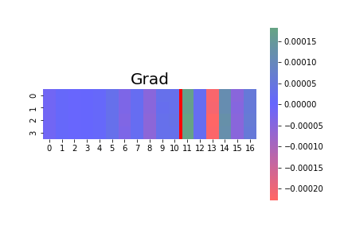
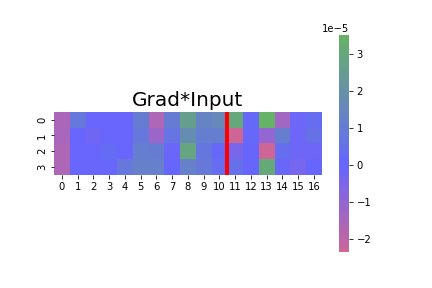


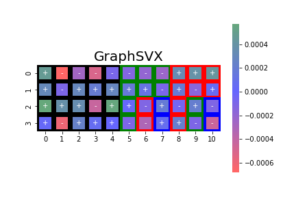

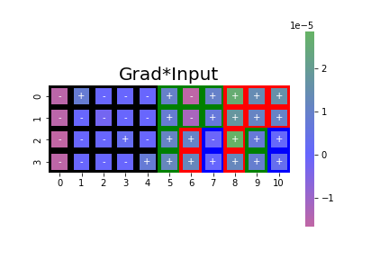


### Simulation 10

* 3 covariables ont un effet positif
* 3 covariables ont un effet négatif
* 1 covariable sans effet
* la premiere covariable avec effet positif et celle avec effet négatif sont mises avec le HSIC

l'objectif est de voir si les scores attribués aux variables avec le HSIC sont plus petits que les autres. 


```{r, fig.dim=c(5, 3),echo=FALSE}
X=read.table("results_for_rmd/res10/res.csv",sep=",",header=T,row.names = 1)
```

```{r,echo=FALSE}
print(paste0("AUC sessions-insectes sans covariables : " , round(mean(X$AUC0),3) ))
print(paste0("AUC sessions-insectes avec covariables : " , round(mean(X$AUC1),3) ))
```
```{r,echo=FALSE}
print(paste0("AUC plantes-insectes sans covariables : " , round(mean(X$AUC3_0),3) ))
print(paste0("AUC plantes-insectes avec covariables : " , round(mean(X$AUC3_1),3) ))
```

```{r, fig.dim=c(5, 3),echo=FALSE}
restable = matrix(colMeans(X[5:ncol(X)]),nrow=3)
rownames(restable)= c("+","-","AUC")
colnames(restable) = c("Shapley","GRAD","GRADxInput","IG","GRAD_LM","IG1_LM")

kable(restable,digits = 2)
```


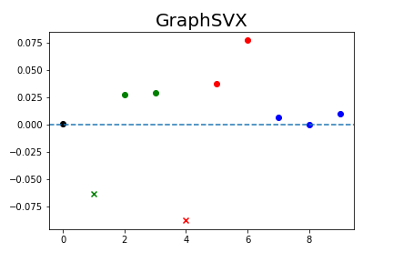


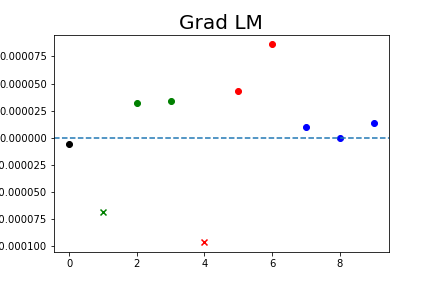


### Simulation 11

* 8 variables ont un effet positif ou négatif en fonction du groupe auquel il appartient
* 50 variables sont sans effet
* la premiere covariable avec effet positif et celle avec effet négatif sont mises avec le HSIC

l'objectif est de voir si les scores attribués aux variables avec le HSIC sont plus petits que les autres.  


```{r, fig.dim=c(5, 3),echo=FALSE}
X=read.table("results_for_rmd/res11/res.csv",sep=",",header=T,row.names = 1)
```

```{r,echo=FALSE}
print(paste0("AUC sessions-insectes sans covariables : " , round(mean(X$AUC0),3) ))
print(paste0("AUC sessions-insectes avec covariables : " , round(mean(X$AUC1),3) ))
```
```{r,echo=FALSE}
print(paste0("AUC plantes-insectes sans covariables : " , round(mean(X$AUC3_0),3) ))
print(paste0("AUC plantes-insectes avec covariables : " , round(mean(X$AUC3_1),3) ))
```

```{r, fig.dim=c(5, 3),echo=FALSE}
restable = matrix(colMeans(X[5:ncol(X)]),nrow=3)
rownames(restable)= c("+","-","AUC")
colnames(restable) = c("Shapley","GRAD","GRADxInput","IG","GRAD_LM","IG1_LM")

kable(restable,digits = 2)
```


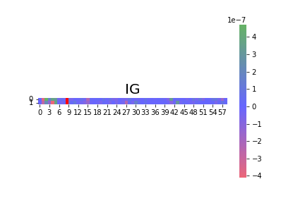
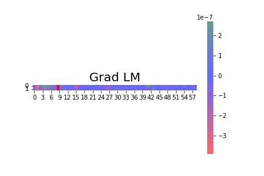
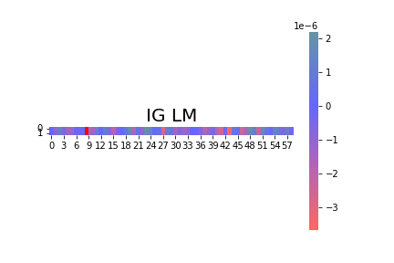


### Simulation 12

Similaire à simulation 9 mais avec HSIC

* Il y a 4 groupes
* 8 variables ont un effet positif ou négatif ou nul en fonction du groupe auquel il appartient
* 8 variables sont sans effet
* la premiere covariable avec effet positif et celle avec effet négatif sont mises avec le HSIC

l'objectif est de voir si les scores attribués aux variables avec le HSIC sont plus petits que les autres.  


```{r, fig.dim=c(5, 3),echo=FALSE}
X=read.table("results_for_rmd/res12/res.csv",sep=",",header=T,row.names = 1)
```

```{r,echo=FALSE}
print(paste0("AUC sessions-insectes sans covariables : " , round(mean(X$AUC0),3) ))
print(paste0("AUC sessions-insectes avec covariables : " , round(mean(X$AUC1),3) ))
```
```{r,echo=FALSE}
print(paste0("AUC plantes-insectes sans covariables : " , round(mean(X$AUC3_0),3) ))
print(paste0("AUC plantes-insectes avec covariables : " , round(mean(X$AUC3_1),3) ))
```

```{r, fig.dim=c(5, 3),echo=FALSE}
restable = matrix(colMeans(X[5:ncol(X)]),nrow=3)
rownames(restable)= c("+","-","AUC")
colnames(restable) = c("Shapley","GRAD","GRADxInput","IG","GRAD_LM","IG1_LM")

kable(restable,digits = 2)
```


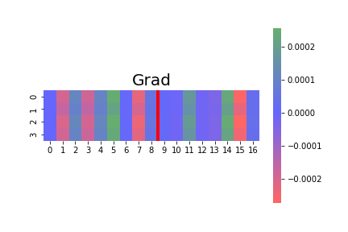

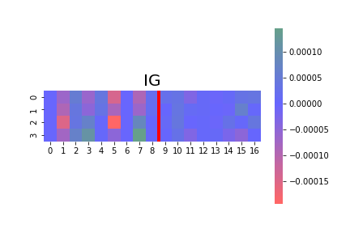


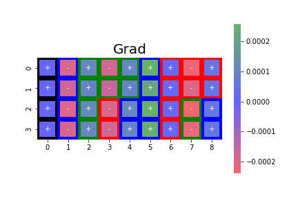
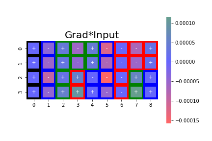
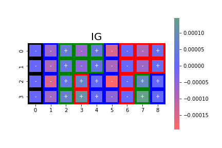


### Simulation 13
Similaire à simulation 9 mais avec HSIC

* Il y a 4 groupes
* 8 variables ont un effet positif ou négatif ou nul en fonction du groupe auquel il appartient
* 8 variables sont sans effet
* 2 covariable sont mises avec le HSIC
* Les groupes sont passés en covariables


```{r, fig.dim=c(5, 3),echo=FALSE}
X=read.table("results_for_rmd/res13/res.csv",sep=",",header=T,row.names = 1)
```

```{r,echo=FALSE}
print(paste0("AUC sessions-insectes sans covariables : " , round(mean(X$AUC0),3) ))
print(paste0("AUC sessions-insectes avec covariables : " , round(mean(X$AUC1),3) ))
```
```{r,echo=FALSE}
print(paste0("AUC plantes-insectes sans covariables : " , round(mean(X$AUC3_0),3) ))
print(paste0("AUC plantes-insectes avec covariables : " , round(mean(X$AUC3_1),3) ))
```

```{r, fig.dim=c(5, 3),echo=FALSE}
restable = matrix(colMeans(X[5:ncol(X)]),nrow=3)
rownames(restable)= c("+","-","AUC")
colnames(restable) = c("Shapley","GRAD","GRADxInput","IG","GRAD_LM","IG1_LM")

kable(restable,digits = 2)
```


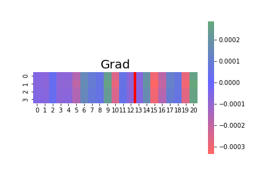

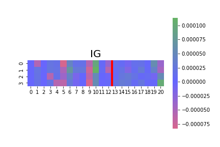

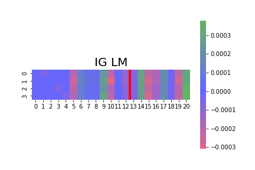


### Simulation 14

* Il y a **83 groupes**
* 8 variables ont un effet positif ou négatif ou nul en fonction du groupe auquel il appartient
* 8 variables sont sans effet
* 2 variables sont mises avec le HSIC
* les groupes sont passés en covariables


```{r, fig.dim=c(5, 3),echo=FALSE}
X=read.table("results_for_rmd/res11/res.csv",sep=",",header=T,row.names = 1)
```

```{r,echo=FALSE}
print(paste0("AUC sessions-insectes sans covariables : " , round(mean(X$AUC0),3) ))
print(paste0("AUC sessions-insectes avec covariables : " , round(mean(X$AUC1),3) ))
```
```{r,echo=FALSE}
print(paste0("AUC plantes-insectes sans covariables : " , round(mean(X$AUC3_0),3) ))
print(paste0("AUC plantes-insectes avec covariables : " , round(mean(X$AUC3_1),3) ))
```

```{r, fig.dim=c(5, 3),echo=FALSE}
restable = matrix(colMeans(X[5:ncol(X)]),nrow=3)
rownames(restable)= c("+","-","AUC")
colnames(restable) = c("Shapley","GRAD","GRADxInput","IG","GRAD_LM","IG1_LM")

kable(restable,digits = 2)
```


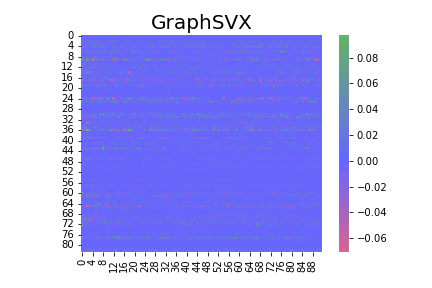

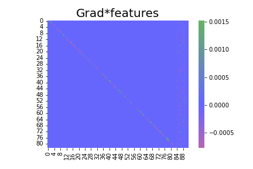
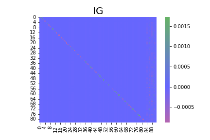


### Simulation 15
Schema complet

* Il y a **83 groupes**
* 8 variables ont un effet positif ou négatif ou nul en fonction du groupe auquel il appartient
* 50 variables sont sans effet
* 2 variables sont mises avec le HSIC
* les groupes sont passés en covariables


```{r, fig.dim=c(5, 3),echo=FALSE}
X=read.table("results_for_rmd/res15/res.csv",sep=",",header=T,row.names = 1)
```

```{r,echo=FALSE}
print(paste0("AUC sessions-insectes sans covariables : " , round(mean(X$AUC0),3) ))
print(paste0("AUC sessions-insectes avec covariables : " , round(mean(X$AUC1),3) ))
```
```{r,echo=FALSE}
print(paste0("AUC plantes-insectes sans covariables : " , round(mean(X$AUC3_0),3) ))
print(paste0("AUC plantes-insectes avec covariables : " , round(mean(X$AUC3_1),3) ))
```

```{r, fig.dim=c(5, 3),echo=FALSE}
restable = matrix(colMeans(X[5:ncol(X)]),nrow=3)
rownames(restable)= c("+","-","AUC")
colnames(restable) = c("Shapley","GRAD","GRADxInput","IG","GRAD_LM","IG1_LM")

kable(restable,digits = 2)
```


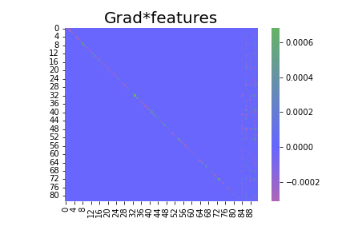


