```{r setup, include=FALSE}
knitr::opts_chunk$set(echo = TRUE)
library(kableExtra)
```

This simulation study tries to replicate numerically the sampling process taking place in the Spipoll data set. Covariates will be use to explain the observation probabilities. The key difference between simulation settings is not the network generation method, but the manner in which the available covariates are incorporated into the model.

## Network generation

**Underlying plant-pollinator network :** An underlying plant-insect network $B_0'$ is generated in order to account for possible interactions. It consists of a bipartite SBM made of $u=83$ plants and $n_2= 306$ insects, with parameters $$\alpha =  (0.3,0.4,0.3),\quad \beta= (0.2,0.4,0.4),\quad  \pi = \begin{bmatrix} 0.95 & 0.80 & 0.50\\ 0.90 & 0.55 & 0.20\\  0.70 & 0.25 & 0.06 \end{bmatrix}, $$ where $\alpha$ is the row groups proportion, $\beta$ the columns group proportion $\pi$ denotes the connectivity matrix.
 This means that for each plant $k$ (resp. insect $j$), there is a latent variable $V^1_k \in \{1,2,3\}$ (resp. $V^2_j \in \{1,2,3\}$) such as  $V^1_k$ follows a multinomial distribution $Mult(1,\alpha)$, $V^2_j \sim Mult(1,\beta)$ and the probability of having an interaction between plant $k$ and insect $j$ is given by $\mathbb{P}(B_{0 k,j}'=1 |V^1_k,V^2_j) = \pi_{V^1_k,V^2_j}$. The given parameters  correspond to a nested network, a model often encountered in ecological study.

 **Session-pollinator network :**  Let $n_1 =1000$ be the number of observers. Each user will select uniformly at random one flower $k$, and will observe possible interactions from the $k$-th row of the matrix $B_0'$ at random, with a probability defined as followed : Let $Z^+\in\mathbb{R}^{n_1 \times D_+}$ and $Z^-\in\mathbb{R}^{n_1 \times D_-}$ such as $Z_{i,j}^+\overset{i.i.d.}{\sim} \mathcal{N}(0,1)$ and  $Z_{i,j}^-\overset{i.i.d.}{\sim} \mathcal{N}(0,1)$ independant of $Z^+$. Let $Z = \left[Z^+| Z^- \right]$ be the concatenation of $Z^+$ and $Z^-$. Let $\beta = (1,\dots,1, -1,\dots,-1)$ a vector whose $D_+$ first coordinates are $1$ and $D_-$ next coordinates are $-1$, and let $\beta_0 \in \mathbb{R}$. Let $p$ be the $n_1$ sized vector such as 
 $$logit(p) = \beta_0\mathbf{1}_{n_1} +  Z\beta^\top,$$ where $logit(.)$ is the element wise application of the logit function. Finally, the probability that user $i$ see insect $j$ in front of flower $k$ is given by 
 $$B_{i,j} \overset{i.i.d.}{\sim} \mathcal{B}(p_i B_{0_{k,j}}'), $$ which means that the user can not see insect $j$ on flower $k$ if  $B_{0_{k,j}}'=0$, and otherwise the insect can be observed with probability $p_i$.
 Once the observations-insects network $B$ is constructed, we also have access to the observed plant-pollinator network $B$ and to $P_{i,k}$ the one-hot-encoded categorical variable that describes the plant taxonomy of the $i$-th sessions.
 Given how the network is constructed, higher values of $Z^+$ are expected to be positively correlated with connectivity, while higher values of $Z^-$ are expected to be negatively correlated with connectivity. The following simulations settings are similar to the previous ones, but are adapted to the Spipoll simulation.

 \textbf{Inputs :} The inputs are identically created as in the simple simulation. The $n_1$ sessions are partitioned into $K$ groups, session $i$ belongs to group $Q[i]$ with $Q[i]\in \{1,\dots,K\}$, $\gamma_{k,j}$ describes the combined effect of group $k$ on the covariate $j$ and 
 $$
 X_{i,j}= \left\{
    \begin{array}{ll}
        \ \gamma_{Q[i],j}Z_{i,j}& \mbox{if } \gamma_{Q[i],j}\neq 0 \\
        \\
        \xi_{i,j}\mbox{ with } \xi_{i,j}\overset{i.i.d.}{\sim} \mathcal{N}(0,1) & \mbox{if }  \gamma_{Q[i],j}=0
    \end{array}
\right.
$$
 Finally, we define $$X_1 = \left[H|X|X^0 \right]$$ where the intercept $H$ is either $\mathbf{1}_{n_1}$ or $\left[\mathbf{1}_{n_1}| P \right]$. Even if it will be the latest assumption, the number of groups $K$ is not necessarily tied to the number of plants $u$. With $X_2 = \mathbf{1}_{n_2}$, BGVAE adaptation to the Spipoll data set is trained with adjacency matrix $B$, plant matrix $P$
 and covariates $X_1,X_2$. The learning can also be done with the fair-BGVAE. In this case, some input columns of $X_1$ are selected and the learning is penalized by the HSIC between the estimated latent space and these columns. Once the model trained, previously described attribution methods are fit on $f_{\widehat{B'}}(X_1)$ to study the impact of the features of $X_1$ on connectivity. 


## Settings

Parameter settings are presented in the following table. We remind that the true latent space is of size $D = D_+ + D_-$ with $D_+ = D_-$, and $D_0$ is the number of the noise covariates. $K$ is the number of groups. $\Gamma$ represents the set of value possibily taken by $\gamma$. The HSIC columns determine how much columns of $X_1$ are penalized by the HSIC during the learning of the Fair BVGAE, empty values correspond to classical BVGAE learning. $H$ corresponds to the intercept.

```{r,echo=FALSE}
table_settings1 = data.frame(row.names = 0:15)
table_settings1["D"] = c(3,3,3,3,1,3,3,3,3,3,3,4,4,4,4,4)
table_settings1["D0"] = c(3,3,50,50,1,50,6,6,6,6,1,50,8,8,8,50)
table_settings1["K"] = c(1)
table_settings1[c(6,7,8,9,10,12,13,14,15,16),"K"] = c(2,2,2,4,4,2,4,4,83,83)
table_settings1["g"] = c("$\\{1\\}$")
table_settings1[c(5,6,8,12),"g"] = c("$\\{1,-1\\}$")
table_settings1[c(7,9,10,13,14,15,16),"g"] = c("$\\{1,0,-1\\}$")
table_settings1["HSIC"] = c("_")
table_settings1[c(11,12,13,14,15,16),"HSIC"] = c(2)
table_settings1["H"] = c("$\\mathbf{1}_{n_1}$")
table_settings1[c(8,10,14,15,16),"H"] = c("$[\\mathbf{1}_{n_1},P]$")
names(table_settings1) = c("$D_+$","$D_0$","K","$\\Gamma$","HSIC","$H$")
kable(table_settings1,booktabs=TRUE,escape = FALSE,align="c",caption ="Parameter table") %>%kable_styling("hover",full_width = T)
```


## Results {.tabset}

For all simulations, the AUC for link prediction with and without covariates are displayed to demonstrate the impact of covariates on the model's learning.

### Simulation 0 

Easiest simulation

* 3 covariates have a positive effect
* 3 covariates have a negative effect
* 3 covariates have no effect

* The algorithm is trained with all the covariates


```{r, fig.dim=c(5, 3),echo=FALSE}
X=read.table("results_for_rmd/res0/res.csv",sep=",",header=T,row.names = 1)
```

```{r,echo=FALSE}
print(paste0("AUC session-pollinator without covariates:" , round(mean(X$AUC0),3) ))
print(paste0("AUC session-pollinator with covariates:" , round(mean(X$AUC1),3) ))
```

```{r,echo=FALSE}
print(paste0("AUCplant-pollinator without covariates: " , round(mean(X$AUC3_0),3) ))
print(paste0("AUCplant-pollinator with covariates: " , round(mean(X$AUC3_1),3) ))
```

```{r, fig.dim=c(5, 3),echo=FALSE}
restable = matrix(colMeans(X[5:ncol(X)]),nrow=3)
rownames(restable)= c("+","-","AUC")
colnames(restable) = c("GraphSVX","GRAD","GRADxInput","IG","GRAD_LM","IG1_LM")

kable(restable,digits = 2)
```


* The dashed line is positioned at zero. 
* The black dot represents the estimated score for the intercept. 
* The green dots represent the estimated score for features where positive values are expected.
* The red dots represent the estimated score for features where negative values are expected.
* The blue dots are scores attributed to noise. 


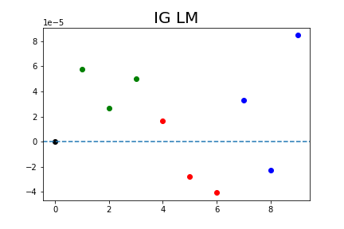


### Simulation 1 


The network is generated with

* 3 covariates have a positive effect
* 3 covariates have a negative effect

The algorithm is trained with

* 2 covariates with positive effect
* 2 covariates with negative effect
* 3 covariates with no effect

```{r, fig.dim=c(5, 3),echo=FALSE}
X=read.table("results_for_rmd/res1/res.csv",sep=",",header=T,row.names = 1)
```

```{r,echo=FALSE}
print(paste0("AUC session-pollinator without covariates:" , round(mean(X$AUC0),3) ))
print(paste0("AUC session-pollinator with covariates:" , round(mean(X$AUC1),3) ))
```

```{r,echo=FALSE}
print(paste0("AUCplant-pollinator without covariates: " , round(mean(X$AUC3_0),3) ))
print(paste0("AUCplant-pollinator with covariates: " , round(mean(X$AUC3_1),3) ))
```

```{r, fig.dim=c(5, 3),echo=FALSE}
restable = matrix(colMeans(X[5:ncol(X)]),nrow=3)
rownames(restable)= c("+","-","AUC")
colnames(restable) = c("GraphSVX","GRAD","GRADxInput","IG","GRAD_LM","IG1_LM")

kable(restable,digits = 2)
```


* The dashed line is positioned at zero. 
* The black dot represents the estimated score for the intercept. 
* The green dots represent the estimated score for features where positive values are expected.
* The red dots represent the estimated score for features where negative values are expected.
* The blue dots are scores attributed to noise. 


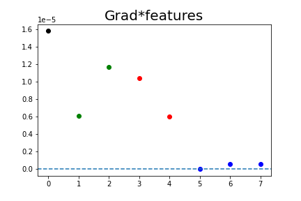
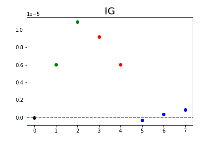


### Simulation 2


* 3 covariates have a positive effect
* 3 covariates have a negative effect
* 50 covariates have no effect

* The algorithm is trained with all the covariates

```{r, fig.dim=c(5, 3),echo=FALSE}
X=read.table("results_for_rmd/res2/res.csv",sep=",",header=T,row.names = 1)
```

```{r,echo=FALSE}
print(paste0("AUC session-pollinator without covariates:" , round(mean(X$AUC0),3) ))
print(paste0("AUC session-pollinator with covariates:" , round(mean(X$AUC1),3) ))
```

```{r,echo=FALSE}
print(paste0("AUCplant-pollinator without covariates: " , round(mean(X$AUC3_0),3) ))
print(paste0("AUCplant-pollinator with covariates: " , round(mean(X$AUC3_1),3) ))
```

```{r, fig.dim=c(5, 3),echo=FALSE}
restable = matrix(colMeans(X[5:ncol(X)]),nrow=3)
rownames(restable)= c("+","-","AUC")
colnames(restable) = c("GraphSVX","GRAD","GRADxInput","IG","GRAD_LM","IG1_LM")

kable(restable,digits = 2)
```


* The dashed line is positioned at zero. 
* The black dot represents the estimated score for the intercept. 
* The green dots represent the estimated score for features where positive values are expected.
* The red dots represent the estimated score for features where negative values are expected.
* The blue dots are scores attributed to noise. 


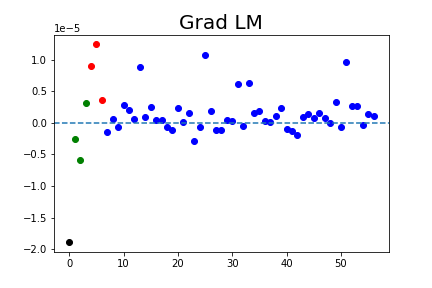
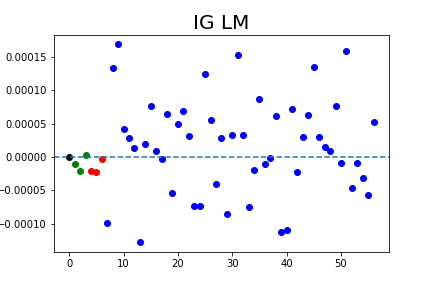


### Simulation 3

The network is generated with

* 3 covariates with a positive effect
* 3 covariates with a negative effect

The algorithm is trained with

* 2 covariates with positive effect
* 2 covariates with negative effect
* 50 covariates have no effect


```{r, fig.dim=c(5, 3),echo=FALSE}
X=read.table("results_for_rmd/res3/res.csv",sep=",",header=T,row.names = 1)
```

```{r,echo=FALSE}
print(paste0("AUC session-pollinator without covariates:" , round(mean(X$AUC0),3) ))
print(paste0("AUC session-pollinator with covariates:" , round(mean(X$AUC1),3) ))
```

```{r,echo=FALSE}
print(paste0("AUCplant-pollinator without covariates: " , round(mean(X$AUC3_0),3) ))
print(paste0("AUCplant-pollinator with covariates: " , round(mean(X$AUC3_1),3) ))
```
```{r, fig.dim=c(5, 3),echo=FALSE}
restable = matrix(colMeans(X[5:ncol(X)]),nrow=3)
rownames(restable)= c("+","-","AUC")
colnames(restable) = c("GraphSVX","GRAD","GRADxInput","IG","GRAD_LM","IG1_LM")

kable(restable,digits = 2)
```


* The dashed line is positioned at zero. 
* The black dot represents the estimated score for the intercept. 
* The green dots represent the estimated score for features where positive values are expected.
* The red dots represent the estimated score for features where negative values are expected.
* The blue dots are scores attributed to noise. 


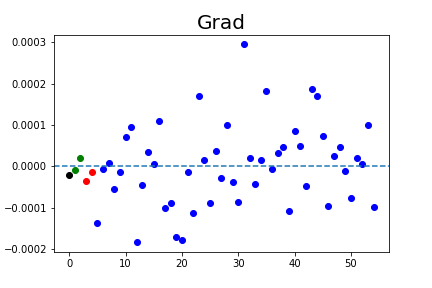


### Simulation 4


* 1 covariate has an effect (+ or -) that depends on a group
* 1 covariate has a negative effect
* 1 covariate has no effect

* The algorithm is trained with all the covariates


```{r, fig.dim=c(5, 3),echo=FALSE}
X=read.table("results_for_rmd/res4/res.csv",sep=",",header=T,row.names = 1)
```

```{r,echo=FALSE}
print(paste0("AUC session-pollinator without covariates:" , round(mean(X$AUC0),3) ))
print(paste0("AUC session-pollinator with covariates:" , round(mean(X$AUC1),3) ))
```
```{r,echo=FALSE}
print(paste0("AUCplant-pollinator without covariates: " , round(mean(X$AUC3_0),3) ))
print(paste0("AUCplant-pollinator with covariates: " , round(mean(X$AUC3_1),3) ))
```

```{r, fig.dim=c(5, 3),echo=FALSE}
restable = matrix(colMeans(X[5:ncol(X)]),nrow=3)
rownames(restable)= c("+","-","AUC")
colnames(restable) = c("GraphSVX","GRAD","GRADxInput","IG","GRAD_LM","IG1_LM")

kable(restable,digits = 2)
```


For all plot, each row represents a group, while each column represents a feature. The top six graphics display the estimated scores for all features. For each cell, the border frame represents the expected value, while the interior represents the estimated value.

* The black frames represent the estimated score for the intercept,
* The green  frames represent the score for features where positive values are expected
* The red frames represent the score for features negative values are expected
* The blue frames are scores attributed to noise. 


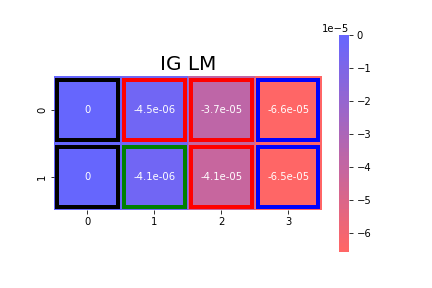


### Simulation 5


* 6 covariates have an effect (+ or -) that depends on a group
* 50 covariates have no effect


```{r, fig.dim=c(5, 3),echo=FALSE}
X=read.table("results_for_rmd/res5/res.csv",sep=",",header=T,row.names = 1)
```

```{r,echo=FALSE}
print(paste0("AUC session-pollinator without covariates:" , round(mean(X$AUC0),3) ))
print(paste0("AUC session-pollinator with covariates:" , round(mean(X$AUC1),3) ))
```

```{r,echo=FALSE}
print(paste0("AUCplant-pollinator without covariates: " , round(mean(X$AUC3_0),3) ))
print(paste0("AUCplant-pollinator with covariates: " , round(mean(X$AUC3_1),3) ))
```
```{r, fig.dim=c(5, 3),echo=FALSE}
restable = matrix(colMeans(X[5:ncol(X)]),nrow=3)
rownames(restable)= c("+","-","AUC")
colnames(restable) = c("GraphSVX","GRAD","GRADxInput","IG","GRAD_LM","IG1_LM")

kable(restable,digits = 2)
```


For all plot, each row represents a group, while each column represents a feature. The top six graphics display the estimated scores for all features. Features to the right of the red lines are noise. The bottom six graphics are zoomed-in sections of the left portion of the top six graphics. For each cell, the border frame represents the expected value, while the interior represents the estimated value.

* The black frames represent the estimated score for the intercept,
* The green  frames represent the score for features where positive values are expected
* The red frames represent the score for features negative values are expected
* The blue frames are scores attributed to noise. 


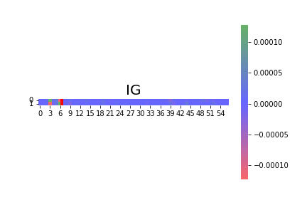


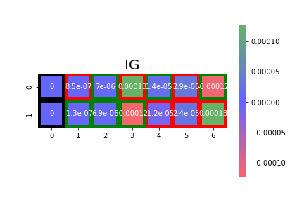


### Simulation 6

* 6 covariates have an effect (+ or - or 0) that depends on a group
* 6 covariates have no effect


```{r, fig.dim=c(5, 3),echo=FALSE}
X=read.table("results_for_rmd/res6/res.csv",sep=",",header=T,row.names = 1)
```

```{r,echo=FALSE}
print(paste0("AUC session-pollinator without covariates:" , round(mean(X$AUC0),3) ))
print(paste0("AUC session-pollinator with covariates:" , round(mean(X$AUC1),3) ))
```

```{r,echo=FALSE}
print(paste0("AUCplant-pollinator without covariates: " , round(mean(X$AUC3_0),3) ))
print(paste0("AUCplant-pollinator with covariates: " , round(mean(X$AUC3_1),3) ))
```
```{r, fig.dim=c(5, 3),echo=FALSE}
restable = matrix(colMeans(X[5:ncol(X)]),nrow=3)
rownames(restable)= c("+","-","AUC")
colnames(restable) = c("GraphSVX","GRAD","GRADxInput","IG","GRAD_LM","IG1_LM")

kable(restable,digits = 2)
```


For all plot, each row represents a group, while each column represents a feature. The top six graphics display the estimated scores for all features. Features to the right of the red lines are noise. The bottom six graphics are zoomed-in sections of the left portion of the top six graphics. For each cell, the border frame represents the expected value, while the interior represents the estimated value.

* The black frames represent the estimated score for the intercept,
* The green  frames represent the score for features where positive values are expected
* The red frames represent the score for features negative values are expected
* The blue frames are scores attributed to noise. 


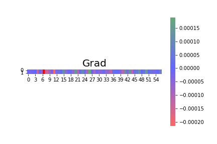


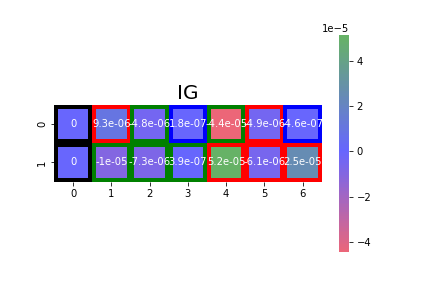


### Simulation 7

* 6 covariates have an effect (+ or -) that depends on a group
* 6 covariates have no effect

* the group is included as a covariate


```{r, fig.dim=c(5, 3),echo=FALSE}
X=read.table("results_for_rmd/res7/res.csv",sep=",",header=T,row.names = 1)
```

```{r,echo=FALSE}
print(paste0("AUC session-pollinator without covariates:" , round(mean(X$AUC0),3) ))
print(paste0("AUC session-pollinator with covariates:" , round(mean(X$AUC1),3) ))
```

```{r,echo=FALSE}
print(paste0("AUCplant-pollinator without covariates: " , round(mean(X$AUC3_0),3) ))
print(paste0("AUCplant-pollinator with covariates: " , round(mean(X$AUC3_1),3) ))
```
```{r, fig.dim=c(5, 3),echo=FALSE}
restable = matrix(colMeans(X[5:ncol(X)]),nrow=3)
rownames(restable)= c("+","-","AUC")
colnames(restable) = c("GraphSVX","GRAD","GRADxInput","IG","GRAD_LM","IG1_LM")

kable(restable,digits = 2)
```


For all plot, each row represents a group, while each column represents a feature. The top six graphics display the estimated scores for all features. Features to the right of the red lines are noise. The bottom six graphics are zoomed-in sections of the left portion of the top six graphics. For each cell, the border frame represents the expected value, while the interior represents the estimated value.

* The black frames represent the estimated score for the intercept,
* The green  frames represent the score for features where positive values are expected
* The red frames represent the score for features negative values are expected
* The blue frames are scores attributed to noise.
* The sign "+" or "-" denotes the sign of the estimated score within each cell.


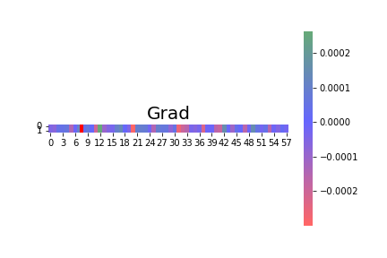


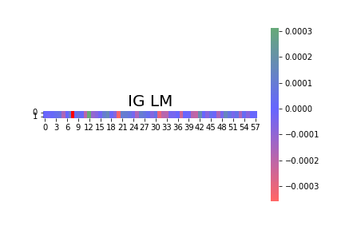


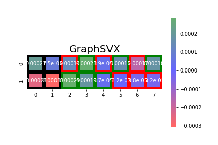


### Simulation 8

* 6 covariates have an effect (+ or - or 0) that depends on a group
* 6 covariates have no effect
* 4 groups with different effects


```{r, fig.dim=c(5, 3),echo=FALSE}
X=read.table("results_for_rmd/res8/res.csv",sep=",",header=T,row.names = 1)
```

```{r,echo=FALSE}
print(paste0("AUC session-pollinator without covariates:" , round(mean(X$AUC0),3) ))
print(paste0("AUC session-pollinator with covariates:" , round(mean(X$AUC1),3) ))
```

```{r,echo=FALSE}
print(paste0("AUCplant-pollinator without covariates: " , round(mean(X$AUC3_0),3) ))
print(paste0("AUCplant-pollinator with covariates: " , round(mean(X$AUC3_1),3) ))
```
```{r, fig.dim=c(5, 3),echo=FALSE}
restable = matrix(colMeans(X[5:ncol(X)]),nrow=3)
rownames(restable)= c("+","-","AUC")
colnames(restable) = c("GraphSVX","GRAD","GRADxInput","IG","GRAD_LM","IG1_LM")

kable(restable,digits = 2)
```


For all plot, each row represents a group, while each column represents a feature. The top six graphics display the estimated scores for all features. Features to the right of the red lines are noise. The bottom six graphics are zoomed-in sections of the left portion of the top six graphics. For each cell, the border frame represents the expected value, while the interior represents the estimated value.

* The black frames represent the estimated score for the intercept,
* The green  frames represent the score for features where positive values are expected
* The red frames represent the score for features negative values are expected
* The blue frames are scores attributed to noise.
* The sign "+" or "-" denotes the sign of the estimated score within each cell.


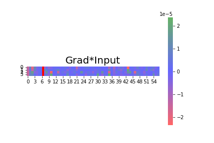


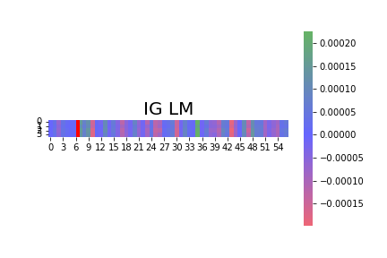


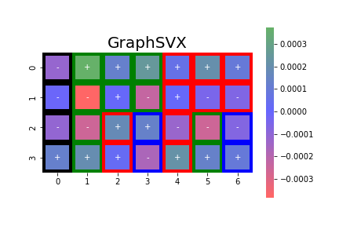


### Simulation 9

* 6 covariates have an effect (+ or - or 0) that depends on a group
* 6 covariates have no effect
* 4 groups with different effects

* the group is included as a covariate


```{r, fig.dim=c(5, 3),echo=FALSE}
X=read.table("results_for_rmd/res9/res.csv",sep=",",header=T,row.names = 1)
```

```{r,echo=FALSE}
print(paste0("AUC session-pollinator without covariates:" , round(mean(X$AUC0),3) ))
print(paste0("AUC session-pollinator with covariates:" , round(mean(X$AUC1),3) ))
```

```{r,echo=FALSE}
print(paste0("AUCplant-pollinator without covariates: " , round(mean(X$AUC3_0),3) ))
print(paste0("AUCplant-pollinator with covariates: " , round(mean(X$AUC3_1),3) ))
```
```{r, fig.dim=c(5, 3),echo=FALSE}
restable = matrix(colMeans(X[5:ncol(X)]),nrow=3)
rownames(restable)= c("+","-","AUC")
colnames(restable) = c("GraphSVX","GRAD","GRADxInput","IG","GRAD_LM","IG1_LM")

kable(restable,digits = 2)
```


For all plot, each row represents a group, while each column represents a feature. The top six graphics display the estimated scores for all features. Features to the right of the red lines are noise. The bottom six graphics are zoomed-in sections of the left portion of the top six graphics. For each cell, the border frame represents the expected value, while the interior represents the estimated value.

* The black frames represent the estimated score for the intercept,
* The green  frames represent the score for features where positive values are expected
* The red frames represent the score for features negative values are expected
* The blue frames are scores attributed to noise.

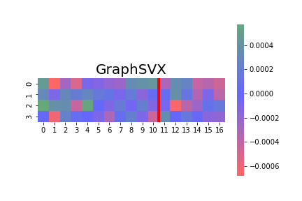


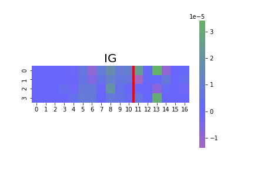


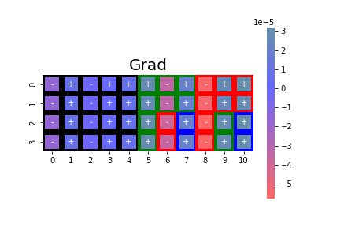


### Simulation 10

* 3 covariates have a positive effect
* 3 covariates have a negative effect
* 3 covariates have no effect
* The first covariate with a positive effect and the one with a negative effect are penalized with the HSIC

The goal is to see if the scores assigned to the variables penalized by the HSIC are smaller than the others.


```{r, fig.dim=c(5, 3),echo=FALSE}
X=read.table("results_for_rmd/res10/res.csv",sep=",",header=T,row.names = 1)
```

```{r,echo=FALSE}
print(paste0("AUC session-pollinator without covariates:" , round(mean(X$AUC0),3) ))
print(paste0("AUC session-pollinator with covariates:" , round(mean(X$AUC1),3) ))
```
```{r,echo=FALSE}
print(paste0("AUCplant-pollinator without covariates: " , round(mean(X$AUC3_0),3) ))
print(paste0("AUCplant-pollinator with covariates: " , round(mean(X$AUC3_1),3) ))
```

```{r, fig.dim=c(5, 3),echo=FALSE}
restable = matrix(colMeans(X[5:ncol(X)]),nrow=3)
rownames(restable)= c("+","-","AUC")
colnames(restable) = c("GraphSVX","GRAD","GRADxInput","IG","GRAD_LM","IG1_LM")

kable(restable,digits = 2)
```


* The dashed line is positioned at zero. 
* The black dot represents the estimated score for the intercept. 
* The green dots represent the estimated score for features where positive values are expected.
* The red dots represent the estimated score for features where negative values are expected.
* The blue dots are scores attributed to noise. 
* Variables penalized by the HSIC are represented with a cross.


### Simulation 11

* 8 covariates have an effect (+ or -) that depends on a group
* 50 covariates have no effect
* The first covariate with a positive effect and the one with a negative effect are penalized with the HSIC

The goal is to see if the scores assigned to the variables penalized by the HSIC are smaller than the others.


```{r, fig.dim=c(5, 3),echo=FALSE}
X=read.table("results_for_rmd/res11/res.csv",sep=",",header=T,row.names = 1)
```

```{r,echo=FALSE}
print(paste0("AUC session-pollinator without covariates:" , round(mean(X$AUC0),3) ))
print(paste0("AUC session-pollinator with covariates:" , round(mean(X$AUC1),3) ))
```
```{r,echo=FALSE}
print(paste0("AUCplant-pollinator without covariates: " , round(mean(X$AUC3_0),3) ))
print(paste0("AUCplant-pollinator with covariates: " , round(mean(X$AUC3_1),3) ))
```

```{r, fig.dim=c(5, 3),echo=FALSE}
restable = matrix(colMeans(X[5:ncol(X)]),nrow=3)
rownames(restable)= c("+","-","AUC")
colnames(restable) = c("GraphSVX","GRAD","GRADxInput","IG","GRAD_LM","IG1_LM")

kable(restable,digits = 2)
```


For all plot, each row represents a group, while each column represents a feature. The top six graphics display the estimated scores for all features. Features to the right of the red lines are noise. The bottom six graphics are zoomed-in sections of the left portion of the top six graphics. For each cell, the border frame represents the expected value, while the interior represents the estimated value.

* The black frames represent the estimated score for the intercept,
* The green  frames represent the score for features where positive values are expected
* The red frames represent the score for features negative values are expected
* The blue frames are scores attributed to noise or to variable penalized by the HSIC. 

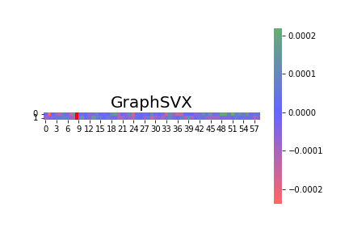


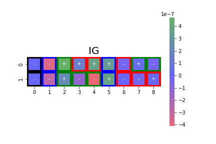


### Simulation 12

Similaire à simulation 9 mais avec HSIC

* 8 covariates have an effect (+ or - or 0) that depends on a group
* 8 covariates have no effect
* 4 groups with different effects
* 2 covariates are penalized with the HSIC


```{r, fig.dim=c(5, 3),echo=FALSE}
X=read.table("results_for_rmd/res12/res.csv",sep=",",header=T,row.names = 1)
```

```{r,echo=FALSE}
print(paste0("AUC session-pollinator without covariates:" , round(mean(X$AUC0),3) ))
print(paste0("AUC session-pollinator with covariates:" , round(mean(X$AUC1),3) ))
```
```{r,echo=FALSE}
print(paste0("AUCplant-pollinator without covariates: " , round(mean(X$AUC3_0),3) ))
print(paste0("AUCplant-pollinator with covariates: " , round(mean(X$AUC3_1),3) ))
```

```{r, fig.dim=c(5, 3),echo=FALSE}
restable = matrix(colMeans(X[5:ncol(X)]),nrow=3)
rownames(restable)= c("+","-","AUC")
colnames(restable) = c("GraphSVX","GRAD","GRADxInput","IG","GRAD_LM","IG1_LM")

kable(restable,digits = 2)
```


For all plot, each row represents a group, while each column represents a feature. The top six graphics display the estimated scores for all features. Features to the right of the red lines are noise. The bottom six graphics are zoomed-in sections of the left portion of the top six graphics. For each cell, the border frame represents the expected value, while the interior represents the estimated value.

* The black frames represent the estimated score for the intercept,
* The green  frames represent the score for features where positive values are expected
* The red frames represent the score for features negative values are expected
* The blue frames are scores attributed to noise or to variable penalized by the HSIC. 
* The sign "+" or "-" denotes the sign of the estimated score within each cell.

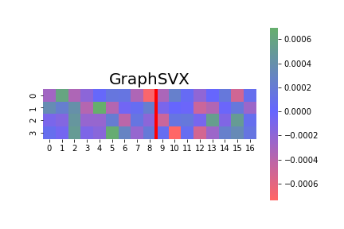

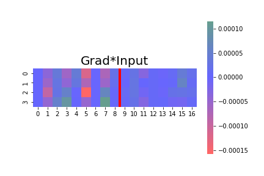

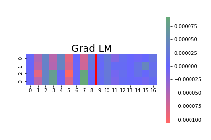
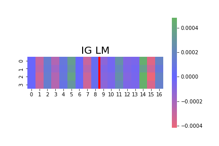


### Simulation 13

* 8 covariates have an effect (+ or - or 0) that depends on a group
* 8 covariates have no effect
* 4 groups with different effects
* 2 covariates are penalized with the HSIC
* the group is included as a covariate


```{r, fig.dim=c(5, 3),echo=FALSE}
X=read.table("results_for_rmd/res13/res.csv",sep=",",header=T,row.names = 1)
```

```{r,echo=FALSE}
print(paste0("AUC session-pollinator without covariates:" , round(mean(X$AUC0),3) ))
print(paste0("AUC session-pollinator with covariates:" , round(mean(X$AUC1),3) ))
```
```{r,echo=FALSE}
print(paste0("AUCplant-pollinator without covariates: " , round(mean(X$AUC3_0),3) ))
print(paste0("AUCplant-pollinator with covariates: " , round(mean(X$AUC3_1),3) ))
```

```{r, fig.dim=c(5, 3),echo=FALSE}
restable = matrix(colMeans(X[5:ncol(X)]),nrow=3)
rownames(restable)= c("+","-","AUC")
colnames(restable) = c("GraphSVX","GRAD","GRADxInput","IG","GRAD_LM","IG1_LM")

kable(restable,digits = 2)
```


For all plot, each row represents a group, while each column represents a feature. The top six graphics display the estimated scores for all features. Features to the right of the red lines are noise. The bottom six graphics are zoomed-in sections of the left portion of the top six graphics. For each cell, the border frame represents the expected value, while the interior represents the estimated value.

* The black frames represent the estimated score for the intercept,
* The green  frames represent the score for features where positive values are expected
* The red frames represent the score for features negative values are expected
* The blue frames are scores attributed to noise or to variable penalized by the HSIC. 
* The sign "+" or "-" denotes the sign of the estimated score within each cell.

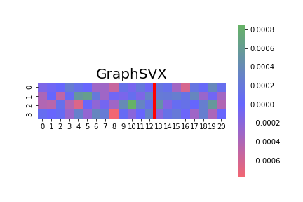


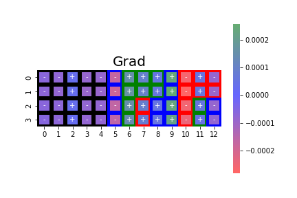
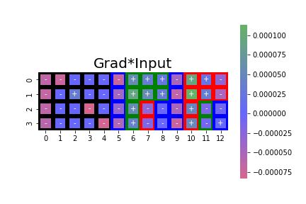
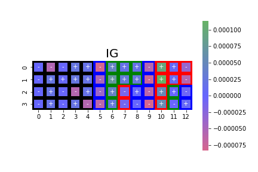


### Simulation 14

* 8 covariates have an effect (+ or - or 0) that depends on a group
* 8 covariates have no effect
* **83 groups** with different effects
* 2 covariates are penalized with the HSIC
* the group is included as a covariate


```{r, fig.dim=c(5, 3),echo=FALSE}
X=read.table("results_for_rmd/res14/res.csv",sep=",",header=T,row.names = 1)
```

```{r,echo=FALSE}
print(paste0("AUC session-pollinator without covariates:" , round(mean(X$AUC0),3) ))
print(paste0("AUC session-pollinator with covariates:" , round(mean(X$AUC1),3) ))
```
```{r,echo=FALSE}
print(paste0("AUCplant-pollinator without covariates: " , round(mean(X$AUC3_0),3) ))
print(paste0("AUCplant-pollinator with covariates: " , round(mean(X$AUC3_1),3) ))
```

```{r, fig.dim=c(5, 3),echo=FALSE}
restable = matrix(colMeans(X[5:ncol(X)]),nrow=3)
rownames(restable)= c("+","-","AUC")
colnames(restable) = c("GraphSVX","GRAD","GRADxInput","IG","GRAD_LM","IG1_LM")

kable(restable,digits = 2)
```


For all plot, each row represents a group, while each column represents a feature. The top six graphics display the estimated scores for all features. Features to the right of the red lines are noise. The bottom six graphics are zoomed-in sections of the left portion of the top six graphics. Expected values are not represented because of the scale of the plot.


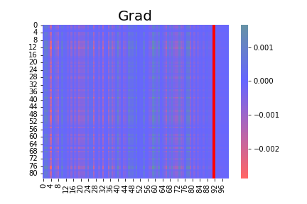
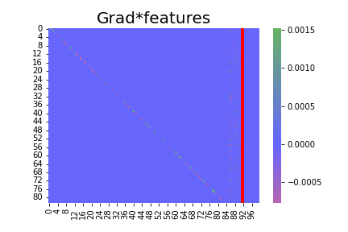

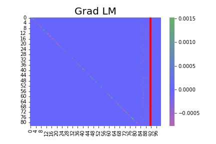


### Simulation 15

* 8 covariates have an effect (+ or - or 0) that depends on a group
* 50 covariates have no effect
* **83 groups** with different effects
* 2 covariates are penalized with the HSIC
* the group is included as a covariate


```{r, fig.dim=c(5, 3),echo=FALSE}
X=read.table("results_for_rmd/res15/res.csv",sep=",",header=T,row.names = 1)
```

```{r,echo=FALSE}
print(paste0("AUC session-pollinator without covariates:" , round(mean(X$AUC0),3) ))
print(paste0("AUC session-pollinator with covariates:" , round(mean(X$AUC1),3) ))
```
```{r,echo=FALSE}
print(paste0("AUCplant-pollinator without covariates: " , round(mean(X$AUC3_0),3) ))
print(paste0("AUCplant-pollinator with covariates: " , round(mean(X$AUC3_1),3) ))
```

```{r, fig.dim=c(5, 3),echo=FALSE}
restable = matrix(colMeans(X[5:ncol(X)]),nrow=3)
rownames(restable)= c("+","-","AUC")
colnames(restable) = c("GraphSVX","GRAD","GRADxInput","IG","GRAD_LM","IG1_LM")

kable(restable,digits = 2)
```


For all plot, each row represents a group, while each column represents a feature. The top six graphics display the estimated scores for all features. Features to the right of the red lines are noise. The bottom six graphics are zoomed-in sections of the left portion of the top six graphics. Expected values are not represented because of the scale of the plot.


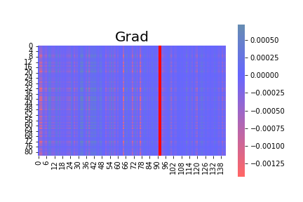


